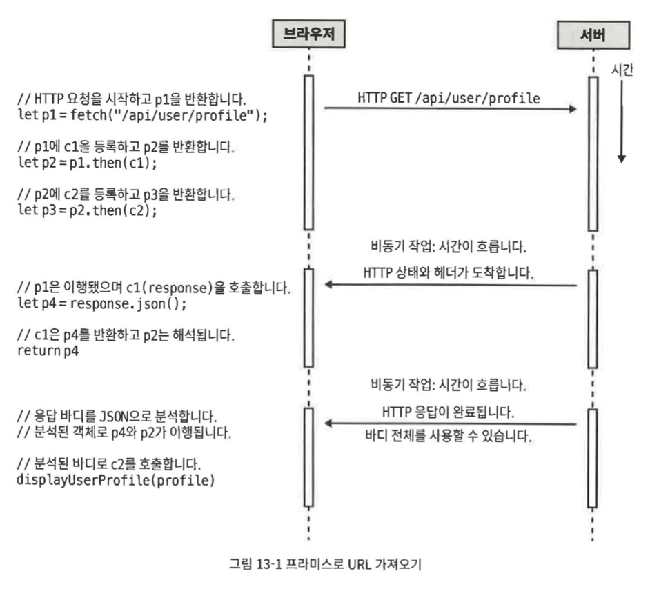

# 13장 비동기 자바스크립트

1. 자바스크립트 프로그램은 일반적으로 이벤트 주도적이다.
   - 즉 프로그램이 실제로 무언가를 실행하기 전에 사용자가 뭔가 클릭하거나 탭하기를 기다린다는 뜻이다.
   - 자바스크립트를 사용하는 서버는 일반적으로 네트워크를 통해 클라이언트 요청이 들어온 후에야 작업을 시작한다.
   - 자바스크립트에서 이런 형태의 비동기 프로그래밍이 필요할 때가 많다.

## 13.1 콜백과 비동기 프로그래밍

1. 자바스크립트에서 가장 기본적인 비동기 프로그래밍은 콜백을 통해 이뤄진다.

   - 콜백은 다른 함수에 전달하는 함수이다.

1. 콜백을 전달받은 함수는 어떤 조건을 만족하거나 어떤 (비동기)이벤트가 일어나면 제공한 함수를 호출(콜백)한다.
   - 전달한 콜백 함수를 호출할 때는 조건이나 이벤트에 대한 정보를 제공하며 때때로 함수 인자를 통해 세부 사항을 추가로 제공하기도 한다.

### 13.1.1 타이머

1. 일정 시간이 지나면 코드가 실행하는 것도 단순한 비동기 프로그래밍 유형 중 하나이다.

   ```tsx
   setTimeout(checkForUpdates, 60000);
   ```

   - `setTimeout()` 은 인자를 전달하지 않고 지정된 콜백 함수를 한 번 호출하고서, 그 함수에 대해 잊어버린다.

### 13.1.2 이벤트

1. 클라이언트 사이드 자바스크립트 프로그램은 거의 대부분 이벤트 주도적이다.

   - 사용자가 뭔갈 하기 기다렸다가 그 행동에 반응한다.

1. 이벤트 주도 자바스크립트 프로그램은 지정된 컨텍스트에 지정된 타입의 이벤트를 처리할 콜백 함수를 등록하고, 웹 브라우저는 지정된 이벤트가 일어날 때마다 함수를 호출한다.

   ```tsx
   addEventListener();
   ```

### 13.1.3 네트워크 이벤트

1. `XMLHttpRequest` 클래스와 콜백 함수를 사용해 HTTP 요청을 보내고 서버의 응답을 비동기적으로 처리

## 13.2 프로미스

1. 프로미스는 비동기 작업의 결과를 나타내는 객체이다.

1. 프로미스의 값을 동기적으로 가져올 수 있는 방법은 존재하지 않는다.

   - 값이 준비됐을 때 콜백 함수를 호출하도록 프로미스에 요청할 수 있을 뿐이다.

1. 콜백의 문제점인 콜백 지옥을 선형에 가까운 프로미스 체인을 통해 읽기 쉽고 이해하기 쉽게 바꿀 수 있다.

1. 프로미스는 에러를 처리하는 방법을 표준화하고 프로미스 체인을 통해 에러를 정확히 전달하는 방법 또한 제공한다.

### 13.2.1 프로미스 사용

1. `JSON`인 `HTTP` 응답 바디를 분석하고 콜백 인자를 받는 대신 프라미스를 반환하는 `getJSON()`함수를 만든다고 가정.

   ```tsx
   getJSON(url).then((jsonData) => {
     // JSON 값을 받아 분석하면 비동기적으로 호출될 콜백 함수이다.
   });
   ```

   - `getJSON()`은 `URL`에 비동기 `HTTP` 요청을 보내고 응답을 대기하면서 프로미스 객체를 반환한다.
     - 프로미스 객체에는 `then()` 인스턴스 메서드가 있다.
   - 콜백 함수를 `getJSON()`에 직접 전달하지 않고 then() 메서드에 전달한다.
   - `HTTP` 응답이 도착하면 응답 바디를 `JSON`으로 분석하고 분석된 값을 `then()`에 전달한 함수에 전달한다.

1. 프로미스 객체에서 `then()` 메서드를 여러 번 호출하면 각 콜백은 비동기 작업이 완료될 때 호출된다.

### 프로미스의 에러 처리

1. 프로미스는 프로미스 객체가 생성된 이후에 일어날 비동기 작업의 결과를 나타낸다.

   - 프로미스 객체가 반환된 후에 동작이 이루어지므로 이 동작이 값을 반환할지, 아니면 캐치할 수 있는 예외를 일으킬지 미리 알 수는 없다.

1. 프로미스의 에러처리 방법

   ```tsx
   getJSON("....").then(displayUserProfile);
   ```

   - `getJSON()`은 정상적으로 완료됐지만 `displayUserProfile()`에서 에러가 일어날 때 어떤일이 벌어질까.
     - 콜백 함수는 `getJSON()`이 완료될 때 비동기적으로 호출되므로 예외를 일으켜도 별 의미가 없다.
     - 예외를 처리할 코드가 콜 스택에 존재하지 않기 때문이다.

   ```tsx
   getJSON("....").then(displayUserProfile).catch(handleProfileError);
   ```

   - 이 코드를 사용하면 `getJSON()`의 일반적인 결과가 `displayUserProfile()`에 전달 되는 것은 그대로이지만, `getJSON()`이나 `displayUserProfile()`의 에러, `displayUserProfile()`에서 일어난 예외는 `handleProfileError()`에 전달된다.

1. 프로미스 용어
   - 용어
     - 자바스크립트 프로미스에서는 이행하다(`fulfill`), 거부하다(`reject`)라는 용어를 쓴다.
     - 프로미스가 이행되지도, 거부되지도 않았다면 대기(`pending`) 중인 것이다.
     - 이행 또는 거부된 프로미스는 완료(`settled`)됐다고 한다.
   - 상태
     - 프로미스는 절대 이행되는 동시에 거부될 수 없다.
     - 완료된 프로미스는 절대 이행이나 거부 상태로 바뀔 수 없다.
   - 프로미스는 비동기 코드의 결과이다.
     - 비동기 코드가 정상적으로 실행되고 프로미스가 이행됐다면 그 결과는 코드의 반환 값이다.
     - 비동기 코드가 정상적으로 완료되지 않고 프로미스가 거부됐다면 그 결과는 코드가 동기적으로 실행했을 때 일으켰을 `Error` 객체나 기타 값이다.
     - 완료된 프로미스에는 항상 연관된 값이 있으며 그 값은 바뀌지 않는다.

### 13.2.2 프로미스 체인

1. 프로미스의 가장 중요한 장점 중 하나는 비동기 작업 시퀀스를 `then()`의 체인으로 이어서 콜백 지온을 방지한다는 점이다.

   ```tsx
   fetch(theURL).then(callback1).then(callback2);
   ```

   - 이렇게 표현식 하나에서 메서드를 하나 이상 호출하는 것을 메서드 체인이라 부른다.
   - 프로미스는 `then()`메서드를 호출할 때마다 새 프로미스 객체를 반환한다.
     - 새 프로미스 객체는 `then()`에 전달된 함수가 완료 되기 전에는 이행되지 않는다.

### 13.2.3 프로미스 해석

```tsx
function c1(response) {
  // 콜백 1
  let p4 = response.json();
  return p4; // 프로미스 4를 반환
}

function c2(profile) {
  // 콜백 2
  displayUserProfile(profile);
}

let p1 = fetch("..."); // 프로미스1, 작업1
let p2 = p1.then(c1); // 프로미스2, 작업2
let p3 = p2.then(c2); // 프로미스3, 작업3
```

1. 세부 사항
   - 콜백 `c`를 `then()` 메서드에 전달하면 `then()`은 프로미스 `p`를 반환하고 나중에 `c`를 비동기적으로 호출할 수 있도록 준비한다.
   - 콜백은 작업을 마치면 값 `v`를 반환한다.
     - 콜백이 완료되면 `p`는 값 `v`로 해석된다.
   - 프로미스가 프로미스가 아닌 값으로 해석되면 그 프로미스는 그 값으로 즉시 이행된다.
   - 따라서 `c`가 프로미스가 아닌 값을 반환하면 그 반환 값은 `p`의 값이 되고, `p`가 이행되면서 끝난다.
   - 반면 반환 값 `v`가 역시 프로미스라면 `p`는 해석되긴 했지만 이행되지는 않은 상태이다.
     - 이 시점에서 `p`는 프로미스 `v`가 완료되기 전에는 완료될 수 없다.
   - `v`가 이행되면 `p`는 같은 값으로 이행된다.
   - `v`가 거부되면 `p`는 같은 이유로 거부된다.
   - 프로미스가 `‘해석’`된 상태라는 말은 프로미스가 다른 프로미스와 `연결`됐다는 의미이다.
   - `p`가 이행됐는지 거부됐는지는 아직 모르지만 콜백 `c`는 이제 아무 권한도 없다.
     - `p`는 `v`에서 어떤 일이 일어나느냐에 따라 달라진다.
2. 예제

   - `c1`이 `p4`를 반환하면 `p2`는 해석된다.
     - 하지만 해석됐다는 말이 이행됐다는 말은 아니므로 `작업3`은 아직 시작되지 않았다.
   - HTTP 응답 바디 전체를 사용할 수 있게 되면 `.json()` 메서드에서 바디를 분석한 값으로 `p4`를 이행할 수 있다.
     - `p4`가 이행되면 `p2` 역시 자동으로 이행되며 그 값은 마찬가지로 `JSON`을 분석한 값이다.
     - 이 시점에서 분석된 `JSON` 객체가 `c2`에 전달되며 `작업3`이 시작된다.

   

### 13.2.4 프로미스와 에러

1. 프로미스 관련 에러는 일반적으로 프로미스 체인에 `.catch()` 메서드를 추가하여 처리한다.

1. 비동기 프로그래밍에서는 에러 처리가 중요하다.

   - 동기적 코드에서는 에러 처리 코드가 없으면 최소한 예외가 발생하고, 스택 추적을 통해 어디서 무엇이 잘못되었는지 파악할 수 있다.
   - 하지만 비동기 코드에서는 처리하지 않은 예외가 아무런 경고 없이 사라질 때가 많고 에러도 조용히 일어날 때가 많아 디버그하기 어렵다.

1. `finally()`
   - 프로미스 체인에 `.finally()`를 추가하면 호출한 프로미스가 완료될 때 `.finally()`가 호출된다.
   - 이 콜백은 프로미스가 이행되거나 거부될 때 호출되며 아무 인자도 받지 않으므로 콜백 안에서 프로미스가 이행됐는지 거부됐는지 알 수 없다.
     - 하지만 프로미스의 이행 여부와 관계없이 파일이나 네트워크 연결을 닫는 것과 같은 정리 작업을 해야 한다면 `.finally()` 콜백이 이상적이다.
   - `.finally()`도 새 프로미스 객체를 반환한다.
     - `.finally()` 콜백의 반환 값은 일반적으로 무시되며, `.finally()`가 반환하는 프로미스는 보통 `.finally()`가 호출된 프로미스가 해석/거부된 값과 같은 값으로 해석/거부 된다.
     - 하지만 `.finally()`콜백이 예외를 일으키면 `.finally()`가 반환하는 프로미스는 그 예외와 함께 거부된다.
