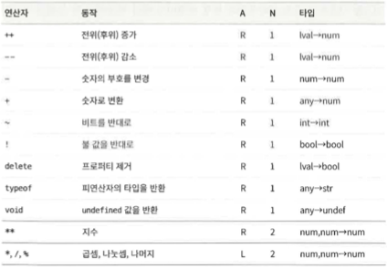
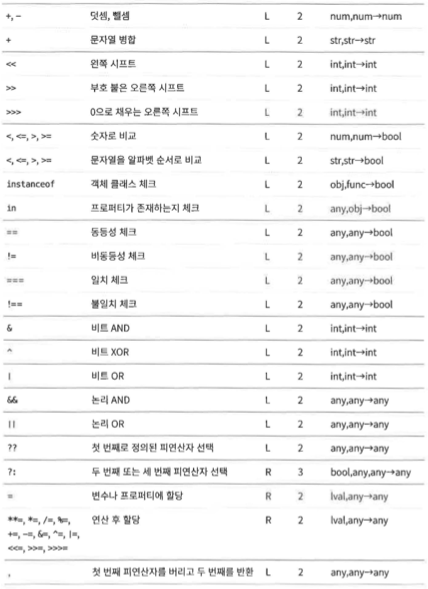

## 4.1 기본 표현식

1. 자바스크립트의 기본 표현식은 상수나 리터럴 값, 일부 키워드, 변수 참조가 있다.

    ```jsx
    1.23; // 숫자 리터럴
    "hello" / // 문자 리터럴
    pattern / // 정규 표현식 리터럴
    // 예약어 중에도 기본 표현식이 있다.
    true; // boolean true로 평가된다.
    false; // boolean false로 평가된다.
    null; // null로 평가된다.
    this; // 'this' 객체로 평가된다.

    // 기본 표현식의 세번째 유형은 변수, 상수, 전역 객체의 프로퍼티에 대한 참조 형태
    i; // 변수 i의 값으로 평가된다.
    sum; // 변수 sum의 값으로 평가된다.
    undefined; /// 전역 객체의 'undefined' 프로퍼티 값
    ```

    - this
        - 다른 키워드와 달리 일정한 값이 아니며 사용한 위치에 따라 다른값으로 평가된다.
        - 메서드 바디에선 해당 메서드를 호출한 객체로 평가된다.

2. 자바스크립트는 프로그램에 있는 식별자를 변수, 상수 또는 전역 객체의 프로퍼티라고 가정하고 그 값을 찾는다.

    -   그런 이름의 변수가 존재하지 않는다면 존재하지 않는 변수를 평가하려는 시도이므로 `ReferenceError`가 발생한다.

## 4.2 객체와 배열 초기화 표현식

1. 객체와 배열의 초기화 표현식은 그 값이 새로 생성된 객체나 배열인 표현식이다.

    - 이런 초기화 표현식을 객체 리터럴 또는 배열 리터럴이라고 부르기도 한다.
        - 하지만 리터럴과 달리 초기화 표현식은 프로퍼티와 요소 값을 지정하는 다양한 하위 표현식으로 구성되므로 기본 표현식은 아니다.

1. 배열 초기화 표현식

    - 대괄호 안에 콤마로 구분된 리스트를 쓰는 형태의 표현식이다.

    ```jsx
    [][(1 + 2, 3 + 4)]; // 빈배열. // 요소가 두개인 배열
    ```

    - 배열 초기화 표현식 내부의 요소 표현식 역시 배열 초기화 표현식이 될 수 있다.

    ```jsx
    let matrix = [
        [1, 2, 3],
        [4, 5, 6],
        [7, 8, 9],
    ];
    ```

    - 배열 초기화 표현식 내의 요소 표현식은 배열 초기화 표현식을 평가할 때마다 평가된다.
        - 즉, 배열 초기화 표현식을 평가할 때마다 결과가 달라질 수 있다.

1. 객체 초기화 표현식

    - 중괄호 안에 각 하위 표현식을 프로퍼티 이름과 콜론(:) 으로 쓰는 형태의 표현식이다.

    ```jsx
    let p = { x: 2.3, y: -1.2 }; // 프로퍼티가 두 개 있는 객체
    let q = {}; // 프로퍼티가 없는 빈 객체
    ```

    - ES6 이후 부터는 객체 리터럴 문법의 기능이 훨씬 풍부해졌다
        - 객체 리터럴은 중첩할 수 있다.

    ```jsx
    let rectangle = {
        upperLeft: { x: 2, y: 2 },
        lowerRight: { x: 4, y: 5 },
    };
    ```

## 4.3 함수 정의 표현식

1. 함수 정의 표현식은 함수를 정의하며 그 값은 함수이다.

    - 함수 리터럴이라고 부를 수도 있다.

    ```jsx
    let square = function (x) {
        return x * x;
    };
    ```

## 4.4 프로퍼티 접근 표현식

1. 프로퍼티 접근 표현식은 객체 프로퍼티나 배열 요소의 값으로 평가된다.

    - 자바스크립트에는 두 가지 프로퍼티 접근 문법이 있다.

    ```jsx
    expression.identifier;
    expression[expression];
    ```

    - 첫 번째는 표현식 뒤에 마침표를 쓰고 그 뒤에 식별자를 쓰는 것이다.
        - 표현식은 객체를 나타내고 식별자는 원하는 프로퍼티 이름이다.
    - 두 번째는 표현식(객체나 배열) 뒤에 대괄호를 쓰고 그 안에 다른 표현식을 쓰는 형태이다.
        - 두 번째 표현식은 프로퍼티 이름이나 배열 요소 인덱스이다.
    - 예제
        ```jsx
        let o = { x: 1, y: { z: 3 } };
        let a = [o, 4, [5, 6]]; // 객체를 담고 있는 배열
        o.x; // 1
        o.x.y; // 3
        o["x"]; // 1
        a[1]; // 4
        a[2]["1"]; // 6
        a[0].x; // 1
        ```
        - 어떤 스타일의 프로퍼티 접근 표현식을 쓰든 `.`이나 `[` 앞에 있는 표현식을 첫 번째로 평가한다.
            - 그 값이 `null`이나 `undefined`이면 이 둘은 프로퍼티를 가질 수 없는 값이므로 표현식은 `TypeError`를 일으킨다.
        - `.` 식별자 문법이 더 간결하긴 하지만, 접근하고자 하는 이름이 유효한 식별자이고 그 이름을 알고 있을 때만 사용할 수 있다.

### 4.4.1 조건부 프로퍼티 접근

```jsx
expression?.identifier;
expression?.[expression];
```

-   `expression` 가 `null`이거나 `undefined`면 이 표현식은 프로퍼티에 접근하려는 시도 없이 `undefined`로 평가된다.

## 4.5 호출 표현식

1. 호출 표현식은 함수나 메서드를 호출하는 문법이다.

    ```jsx
    f(0); // f는 함수 표현식이고 0는 인자 표현식이다.
    Math.max(x, y, z); // Math.max는 함수이고 x,y,z는 인자이다.
    a.sort; // a.sort는 함수이고 인자는 없다.
    ```

    - 호출 표현식을 평가할 때는 첫번째로 함수 표현식을 평가하고 그 다음으로 함수 인자 표현식을 평가해 인자 값 리스트를 만든다.
        - 함수 표현식의 값이 함수가 아니라면 `TypeError`를 일으킨다.
        - 인자 값을 함수를 정의할 때 지정된 함수 매개변수(`parameter`)에 순서대로 할당한 다음, 함수 바디를 실행한다.
            - 함수가 `return`문을 사용해 값을 반환한다면 그 값이 호출 표현식의 값이다.
            - 그렇지 않다면 호출 표현식의 값은 `undefined`이다.
    - 호출 표현식 맨 앞에 있는 표현식이 프로퍼티 접근 표현식이라면 이 호출은 메서드 호출이라고 한다.
        - 메서드 호출에서 프로퍼티 접근 대상인 객체 또는 배열은 함수 바디가 실행되는 동안 `this` 키워드의 값이 된다.

    ### 4.5.1 조건부 호출

    1. ES2020에서는 `()` 대신 `?.()`를 통해 함수를 호출할 수 있다.

        - `조건부 프로퍼티 접근`과 비슷
        - 예제

            ```jsx
            // 과거
            function square(x, log) {
                if (log) {
                    log(x);
                }

                return x * x;
            }

            // ES2020
            function square(x, log) {
                log?.(x);

                return x * x;
            }
            ```

            - 주의사항
                - `?.()` 는 왼쪽에 있는 것이 `null`이나 `undefined`인지만 체크한다.
                    - 이 값이 실제로 함수인지는 체크하지 않는다.
                    - 예를 들어 예제의 함수에 숫자 두개를 전달한다면 여전히 예외가 일어난다.

        - 표현식의 차이
            ```jsx
            o.m(); // 일반적인 프로퍼티 접근, 일반적인 호출
            o?.m(); // 조건부 프로퍼티 접근, 일반적인 호출
            0m?.(); // 일반적인 프로퍼티 접근, 조건부 호출
            ```

## 4.6 객체 생성 표현식

1. 객체 생성 표현식은 객체를 생성하고 함수를 호출해 객체 프로퍼티를 초기화한다.

    - 호출 표현식과 같지만, 그 앞에 `new` 키워드를 붙인 다는 점이 다르다.

    ```jsx
    new Object();
    new Point(2, 3);
    ```

    - 객체 생성 표현식에서 생성자 함수에 전달할 인자가 없다면 빈 괄호는 생략 가능하다.

    ```jsx
    new Object();
    new Date();
    ```

## 4.7 연산자 개요

1. 연산자는 산술 표현식, 비교 표현식, 논리 표현식, 할당 표현식 동에 사용된다.
    - 대부분의 연산자는 `+`나 `=`처럼 부호로 표현됩니다. 물론 `delete`나 `instanceof` 같은 키워드 연산자도 있습니다.
    - 키워드 연산자도 부호로 표현된 것과 마찬가지로 일반적인 연산자이며 단지 문법이 덜 간결할뿐이다.
2. 표

    - 연산자 우선순위에 따라 배치
        - 앞에 있는 연산자는 뒤에 있는 연산자보다 우선순위가 높다.
        - 굵은 가로선으로 구분한 것은 연산자 우선순위 가 다르다는 뜻이다.
    - A로 표시한 열은 연산자 결합성 (`associativity`)을 나타냄니 다. L은 왼쪽에서 오른쪽, R은 오른쪽에서 왼쪽을 뜻한다.
    - N으로 표시한 열은 피 연산자 개수이다.
    - 타입이라고 표시한 열은 피연산자와 결과(화살표 뒤)의 타입을 뜻한다.

    

    

    ### 4.7.1 피연산자 개수

    1. 연산자는 예상하는 피연산자 개수(항)를 기준으로 분류할 수 있다.
        - 곱셈 연산자 `*`처럼 자바스크립트 연산자 대부분은 표현식 두 개를 조합해 하나로 만드는 2항 연산자이다.
        - 자바스크립트는 표현식 하나를 다른 표현식으로 변환하는 단항 연산자 역시 지원한다.
        - `?:` 는 조건 연산자라고도 부르면 3항 연산자이다.

    ### 4.7.2 피연산자와 결과 타입

    1. 값의 타입에 관계없이 동작하는 연산자도 있지만, 대부분은 피연산자가 특정 타입일 것으로 간주하며 특정 타입의 값을 반환한다.
    2. 자바스크립트 연산자는 필요에 따라 피연산자의 타입을 변환한다.
        - `+` 연산자
            - 피연산자가 숫자면 더하고, 문자열이면 병합한다.
        - `<` 같은 비교 연산자
            - 피연산자 타입에 따라 숫자 순서로도, 알파벳 순서로도 비교할 수 있다.
    3. `lval` 타입
        - 왼쪽 값(`lvalue`)은 ‘할당 표현식의 왼쪽에 나타날 수 있는 표현식’ 을 가리키는 오래된 용어이다.

    ### 4.7.3 연산자와 부수 효과

    1. 일부 표현식에는 이후의 평가 결과에 영향을 미치는 부수 효과가 있다.
        - 할당 연산자가 명백한 예이다.
            - 변수나 프로퍼티에 값을 할당하면 해당 변수나 프로퍼티를 사용하는 모든 표현식에 영향을 미친다.
            - 증가 연산자 `++`나 감소 연산자 `--` 역시 묵시적으로 할당의 역할을 하므로 비슷한 영향이 있다.
            - `delete` 연산자 역시 부수 효과가 있다.
                - 프로퍼티를 삭제하는 것은 해당 프로퍼티에 `undefined`를 할당하는 것과 비슷하다.

    ### 4.7.4 연산자 우선순위

    1. 우선순위가 높은연산자는 우선순위가 낮은 연산자보다 먼저 실행된다.

        - 어떤 연산자보다도 프로퍼티 접근과 호출 표현식의 우선순위가 더 높다.

        ```jsx
        // my에는 functions라는 프로퍼티가 있고 그 값은
        // 함수의 배열이다. 번호가 x인 함수를 호출하면서 인자 y를 전달하고
        // 반환되는 값의 타입을 구한다.
        typeof my.functions[x](y);
        ```

        - typeof 연산자는 우선순위가 가장 높은 연산자 중 하나이지만
            - typeof 동작은 프로퍼티 접근, 배열 인덱스, 함수 호출 다음에 이루어진다.
            - 이들은 모두 연산자보다 우선순위가 높다.

    2. 연산자 우선순위가 불확실 하다면?
        - 괄호를 사용해서 순서를 명시적으로 정하자

    ### 4.7.5 연산자 결합성

    1. 연산 자의 결합성은 우선순위가 같은 동작을 수행할 때의 순서이다.

        ```jsx
        w = x - y - z;

        // ->

        w = x - y - z;

        // -----------------------------------

        y = a ** (b ** c);
        x = ~-y;
        w = x = y = z;
        q = a ? b : c ? d : e ? f : g;

        // ->

        y = a ** (b ** c);
        x = ~-y;
        w = x = y = z;
        q = a ? b : c ? d : e ? f : g;
        ```

    ### 4.7.6 평가 순서

    1. 연산자 우선순위와 연관성은 복잡한 표현식에서 어떤 순서로 동작이 수행되는지는 지정하지만, 하위 표현식이 평가되는 순서는 지정하지 않는다.
        - 자바스크립트는 항상 표현식을 왼쪽에서 오른쪽으로 평가한다.
