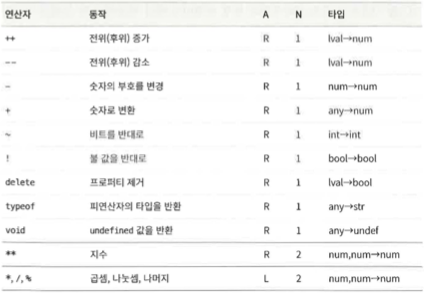
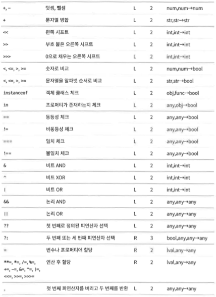
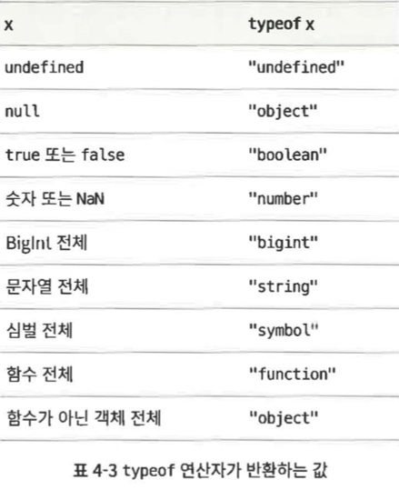

## 4.1 기본 표현식

1. 자바스크립트의 기본 표현식은 상수나 리터럴 값, 일부 키워드, 변수 참조가 있다.

    ```jsx
    1.23; // 숫자 리터럴
    "hello" / // 문자 리터럴
        pattern / // 정규 표현식 리터럴
        // 예약어 중에도 기본 표현식이 있다.
        true; // boolean true로 평가된다.
    false; // boolean false로 평가된다.
    null; // null로 평가된다.
    this; // 'this' 객체로 평가된다.

    // 기본 표현식의 세번째 유형은 변수, 상수, 전역 객체의 프로퍼티에 대한 참조 형태
    i; // 변수 i의 값으로 평가된다.
    sum; // 변수 sum의 값으로 평가된다.
    undefined; /// 전역 객체의 'undefined' 프로퍼티 값
    ```

    - this
        - 다른 키워드와 달리 일정한 값이 아니며 사용한 위치에 따라 다른값으로 평가된다.
        - 메서드 바디에선 해당 메서드를 호출한 객체로 평가된다.

2. 자바스크립트는 프로그램에 있는 식별자를 변수, 상수 또는 전역 객체의 프로퍼티라고 가정하고 그 값을 찾는다.

-   그런 이름의 변수가 존재하지 않는다면 존재하지 않는 변수를 평가하려는 시도이므로 `ReferenceError`가 발생한다.

## 4.2 객체와 배열 초기화 표현식

1. 객체와 배열의 초기화 표현식은 그 값이 새로 생성된 객체나 배열인 표현식이다.

    - 이런 초기화 표현식을 객체 리터럴 또는 배열 리터럴이라고 부르기도 한다.
        - 하지만 리터럴과 달리 초기화 표현식은 프로퍼티와 요소 값을 지정하는 다양한 하위 표현식으로 구성되므로 기본 표현식은 아니다.

1. 배열 초기화 표현식

    - 대괄호 안에 콤마로 구분된 리스트를 쓰는 형태의 표현식이다.

    ```jsx
    [][(1 + 2, 3 + 4)]; // 빈배열. // 요소가 두개인 배열
    ```

    - 배열 초기화 표현식 내부의 요소 표현식 역시 배열 초기화 표현식이 될 수 있다.

    ```jsx
    let matrix = [
        [1, 2, 3],
        [4, 5, 6],
        [7, 8, 9],
    ];
    ```

    - 배열 초기화 표현식 내의 요소 표현식은 배열 초기화 표현식을 평가할 때마다 평가된다.
        - 즉, 배열 초기화 표현식을 평가할 때마다 결과가 달라질 수 있다.

1. 객체 초기화 표현식

    - 중괄호 안에 각 하위 표현식을 프로퍼티 이름과 콜론(:) 으로 쓰는 형태의 표현식이다.

    ```jsx
    let p = { x: 2.3, y: -1.2 }; // 프로퍼티가 두 개 있는 객체
    let q = {}; // 프로퍼티가 없는 빈 객체
    ```

    - ES6 이후 부터는 객체 리터럴 문법의 기능이 훨씬 풍부해졌다
        - 객체 리터럴은 중첩할 수 있다.

    ```jsx
    let rectangle = {
        upperLeft: { x: 2, y: 2 },
        lowerRight: { x: 4, y: 5 },
    };
    ```

## 4.3 함수 정의 표현식

1. 함수 정의 표현식은 함수를 정의하며 그 값은 함수이다.

    - 함수 리터럴이라고 부를 수도 있다.

    ```jsx
    let square = function (x) {
        return x * x;
    };
    ```

## 4.4 프로퍼티 접근 표현식

1. 프로퍼티 접근 표현식은 객체 프로퍼티나 배열 요소의 값으로 평가된다.

    - 자바스크립트에는 두 가지 프로퍼티 접근 문법이 있다.

    ```jsx
    expression.identifier;
    expression[expression];
    ```

    - 첫 번째는 표현식 뒤에 마침표를 쓰고 그 뒤에 식별자를 쓰는 것이다.
        - 표현식은 객체를 나타내고 식별자는 원하는 프로퍼티 이름이다.
    - 두 번째는 표현식(객체나 배열) 뒤에 대괄호를 쓰고 그 안에 다른 표현식을 쓰는 형태이다.
        - 두 번째 표현식은 프로퍼티 이름이나 배열 요소 인덱스이다.
    - 예제
        ```jsx
        let o = { x: 1, y: { z: 3 } };
        let a = [o, 4, [5, 6]]; // 객체를 담고 있는 배열
        o.x; // 1
        o.x.y; // 3
        o["x"]; // 1
        a[1]; // 4
        a[2]["1"]; // 6
        a[0].x; // 1
        ```
        - 어떤 스타일의 프로퍼티 접근 표현식을 쓰든 `.`이나 `[` 앞에 있는 표현식을 첫 번째로 평가한다.
            - 그 값이 `null`이나 `undefined`이면 이 둘은 프로퍼티를 가질 수 없는 값이므로 표현식은 `TypeError`를 일으킨다.
        - `.` 식별자 문법이 더 간결하긴 하지만, 접근하고자 하는 이름이 유효한 식별자이고 그 이름을 알고 있을 때만 사용할 수 있다.

### 4.4.1 조건부 프로퍼티 접근

```jsx
expression?.identifier;
expression?.[expression];
```

-   `expression` 가 `null`이거나 `undefined`면 이 표현식은 프로퍼티에 접근하려는 시도 없이 `undefined`로 평가된다.

## 4.5 호출 표현식

1. 호출 표현식은 함수나 메서드를 호출하는 문법이다.

    ```jsx
    f(0); // f는 함수 표현식이고 0는 인자 표현식이다.
    Math.max(x, y, z); // Math.max는 함수이고 x,y,z는 인자이다.
    a.sort; // a.sort는 함수이고 인자는 없다.
    ```

    - 호출 표현식을 평가할 때는 첫번째로 함수 표현식을 평가하고 그 다음으로 함수 인자 표현식을 평가해 인자 값 리스트를 만든다.
        - 함수 표현식의 값이 함수가 아니라면 `TypeError`를 일으킨다.
        - 인자 값을 함수를 정의할 때 지정된 함수 매개변수(`parameter`)에 순서대로 할당한 다음, 함수 바디를 실행한다.
            - 함수가 `return`문을 사용해 값을 반환한다면 그 값이 호출 표현식의 값이다.
            - 그렇지 않다면 호출 표현식의 값은 `undefined`이다.
    - 호출 표현식 맨 앞에 있는 표현식이 프로퍼티 접근 표현식이라면 이 호출은 메서드 호출이라고 한다.
        - 메서드 호출에서 프로퍼티 접근 대상인 객체 또는 배열은 함수 바디가 실행되는 동안 `this` 키워드의 값이 된다.

    ### 4.5.1 조건부 호출

    1. ES2020에서는 `()` 대신 `?.()`를 통해 함수를 호출할 수 있다.

        - `조건부 프로퍼티 접근`과 비슷
        - 예제

            ```jsx
            // 과거
            function square(x, log) {
                if (log) {
                    log(x);
                }

                return x * x;
            }

            // ES2020
            function square(x, log) {
                log?.(x);

                return x * x;
            }
            ```

            - 주의사항
                - `?.()` 는 왼쪽에 있는 것이 `null`이나 `undefined`인지만 체크한다.
                    - 이 값이 실제로 함수인지는 체크하지 않는다.
                    - 예를 들어 예제의 함수에 숫자 두개를 전달한다면 여전히 예외가 일어난다.

        - 표현식의 차이
            ```jsx
            o.m(); // 일반적인 프로퍼티 접근, 일반적인 호출
            o?.m(); // 조건부 프로퍼티 접근, 일반적인 호출
            0m?.(); // 일반적인 프로퍼티 접근, 조건부 호출
            ```

## 4.6 객체 생성 표현식

1. 객체 생성 표현식은 객체를 생성하고 함수를 호출해 객체 프로퍼티를 초기화한다.

    - 호출 표현식과 같지만, 그 앞에 `new` 키워드를 붙인 다는 점이 다르다.

    ```jsx
    new Object();
    new Point(2, 3);
    ```

    - 객체 생성 표현식에서 생성자 함수에 전달할 인자가 없다면 빈 괄호는 생략 가능하다.

    ```jsx
    new Object();
    new Date();
    ```

## 4.7 연산자 개요

1. 연산자는 산술 표현식, 비교 표현식, 논리 표현식, 할당 표현식 동에 사용된다.
    - 대부분의 연산자는 `+`나 `=`처럼 부호로 표현됩니다. 물론 `delete`나 `instanceof` 같은 키워드 연산자도 있습니다.
    - 키워드 연산자도 부호로 표현된 것과 마찬가지로 일반적인 연산자이며 단지 문법이 덜 간결할뿐이다.
2. 표

    - 연산자 우선순위에 따라 배치
        - 앞에 있는 연산자는 뒤에 있는 연산자보다 우선순위가 높다.
        - 굵은 가로선으로 구분한 것은 연산자 우선순위 가 다르다는 뜻이다.
    - A로 표시한 열은 연산자 결합성 (`associativity`)을 나타냄니 다. L은 왼쪽에서 오른쪽, R은 오른쪽에서 왼쪽을 뜻한다.
    - N으로 표시한 열은 피 연산자 개수이다.
    - 타입이라고 표시한 열은 피연산자와 결과(화살표 뒤)의 타입을 뜻한다.

    

    

    ### 4.7.1 피연산자 개수

    1. 연산자는 예상하는 피연산자 개수(항)를 기준으로 분류할 수 있다.
        - 곱셈 연산자 `*`처럼 자바스크립트 연산자 대부분은 표현식 두 개를 조합해 하나로 만드는 2항 연산자이다.
        - 자바스크립트는 표현식 하나를 다른 표현식으로 변환하는 단항 연산자 역시 지원한다.
        - `?:` 는 조건 연산자라고도 부르면 3항 연산자이다.

    ### 4.7.2 피연산자와 결과 타입

    1. 값의 타입에 관계없이 동작하는 연산자도 있지만, 대부분은 피연산자가 특정 타입일 것으로 간주하며 특정 타입의 값을 반환한다.
    2. 자바스크립트 연산자는 필요에 따라 피연산자의 타입을 변환한다.
        - `+` 연산자
            - 피연산자가 숫자면 더하고, 문자열이면 병합한다.
        - `<` 같은 비교 연산자
            - 피연산자 타입에 따라 숫자 순서로도, 알파벳 순서로도 비교할 수 있다.
    3. `lval` 타입
        - 왼쪽 값(`lvalue`)은 ‘할당 표현식의 왼쪽에 나타날 수 있는 표현식’ 을 가리키는 오래된 용어이다.

    ### 4.7.3 연산자와 부수 효과

    1. 일부 표현식에는 이후의 평가 결과에 영향을 미치는 부수 효과가 있다.
        - 할당 연산자가 명백한 예이다.
            - 변수나 프로퍼티에 값을 할당하면 해당 변수나 프로퍼티를 사용하는 모든 표현식에 영향을 미친다.
            - 증가 연산자 `++`나 감소 연산자 `--` 역시 묵시적으로 할당의 역할을 하므로 비슷한 영향이 있다.
            - `delete` 연산자 역시 부수 효과가 있다.
                - 프로퍼티를 삭제하는 것은 해당 프로퍼티에 `undefined`를 할당하는 것과 비슷하다.

    ### 4.7.4 연산자 우선순위

    1. 우선순위가 높은연산자는 우선순위가 낮은 연산자보다 먼저 실행된다.

        - 어떤 연산자보다도 프로퍼티 접근과 호출 표현식의 우선순위가 더 높다.

        ```jsx
        // my에는 functions라는 프로퍼티가 있고 그 값은
        // 함수의 배열이다. 번호가 x인 함수를 호출하면서 인자 y를 전달하고
        // 반환되는 값의 타입을 구한다.
        typeof my.functions[x](y);
        ```

        - typeof 연산자는 우선순위가 가장 높은 연산자 중 하나이지만
            - typeof 동작은 프로퍼티 접근, 배열 인덱스, 함수 호출 다음에 이루어진다.
            - 이들은 모두 연산자보다 우선순위가 높다.

    2. 연산자 우선순위가 불확실 하다면?
        - 괄호를 사용해서 순서를 명시적으로 정하자

    ### 4.7.5 연산자 결합성

    1. 연산 자의 결합성은 우선순위가 같은 동작을 수행할 때의 순서이다.

        ```jsx
        w = x - y - z;

        // ->

        w = x - y - z;

        // -----------------------------------

        y = a ** (b ** c);
        x = ~-y;
        w = x = y = z;
        q = a ? b : c ? d : e ? f : g;

        // ->

        y = a ** (b ** c);
        x = ~-y;
        w = x = y = z;
        q = a ? b : c ? d : e ? f : g;
        ```

    ### 4.7.6 평가 순서

    1. 연산자 우선순위와 연관성은 복잡한 표현식에서 어떤 순서로 동작이 수행되는지는 지정하지만, 하위 표현식이 평가되는 순서는 지정하지 않는다.
        - 자바스크립트는 항상 표현식을 왼쪽에서 오른쪽으로 평가한다.

## 4.8 산술 표현식

1. 기본 산술 연산자
    - `**` (지수)
    - `*` (곱셈)
    - `/` (나눗셈)
    - `%` (나머지)
    - `+` (덧셈)
    - `-` (뺄셈)
2. 우선순위
    - `**` > `* , / , %` > `+ , -`
3. `**` 연산자
    - 오른쪽에서 왼쪽으로 동작
        - `2 ** 2 ** 3`은 `2 ** 8` 과 같다.
4. `/` 연산자
    - 첫번째 피연산자를 두번째 피연산자로 나눈다.
    - 자바스크립트에서는 모든 숫자가 부동 소수점이므로 나눗셈의 결과 역시 항상 부동 소수점이다.
5. `%` 연산자
    - 첫번째 피연산자를 두번째 피연산자로 나눈 나머지이다.
    - 결과의 부호는 첫번째 피연산자를 따른다.

### 4.8.1 `+` 연산자

1. 2항 연산자 `+` 는 숫자 피연산자는 더하고 문자열 피연산자는 병합한다.

    ```jsx
    1 + 2; // 3
    "hello" + "" + "there"; // 'hello there'
    "1" + "2"; // '12'
    ```

2. `+` 연산자의 변환 규칙
    - 문자열 병합에 우선순위가 있다.
        - 피연산자 중 하나가 문자열 또는 문자열로 변환할 수 있는 객체라면 다른 피연산자를 문자열로 변환하고 둘을 병합한다.
        - 두 피연산자 모두 문자열로 판단할 수 없을 때에만 덧샘을 수행한다.
    - 변환 순서
        - 피연산 중 하나가 객체라면 객체에서 기본 값으로 변환하는 알고리즘을 사용해 기본 값으로 변환한다.
            - `Date`객체는 `toString()` 메서드를 호출하며 다른 객체는 `valueOf()` 메서드를 호출한다.
            - 하지만 대부분의 객체에서 `valueOf()` 메서드는 그리 유용하지 않으므로 대개는 `toString()`이 호출된다.
        - 객체에서 기본 값으로 변환하고 난 뒤 피연산자 중 하나가 문자열이면 다른 하나를 문자열로 변환한 다음 병합한다.
        - 둘 다 문자열이 아니라면 숫자 또는 `NaN`로 변환한 후 더한다.
        ```jsx
        1 + 2; // 3 덧셈
        "1" + "2"; // '12' 병합
        "1" + 2; // '12' 숫자를 문자열로 변환한 후 병합
        1 + {}; // '1[object] [Object]' 객체를 문자열로 변환한 후 병합
        true + true; // 2 불리언 값을 숫자로 변환한 후 덧셈
        2 + null; // 2 null값을 0으로 변환한 후 덧셈
        2 + undefined; // NaN undefined를 NaN로 변환한 후 덧셈
        ```
    - `+` 연산자의 피연산자가 문자열과 숫자일 때 그 연관성은 명확하지 않다. 즉, 동작 순서에 따라 결과가 달라질 수 있다
        ```jsx
        1 + 2 + "blind mice"; // '3 'blind mice'
        1 + (2 + "blind mice"); // '12 'blind mice'
        ```

### 4.8.2 단항 산술 연산자

1. 단항 연산자는 피연산자 하나의 값을 바꿔 새 값을 얻는다.
2. 단항 연산자는 모두 우선순위가 높으며 전부 오른쪽에서 왼쪽으로 연산을 수행한다.
3. 단항 플러스 ( `+` )
    - 단항 플러스 연산자는 피연산자를 숫자 (또는 `NaN`)로 변환한 값을 반환한다.
    - `BigInt` 값은 일반적인 숫자로 변환할 수 없으므로 단항 플러스 연산자를 사용할 수 없다.
4. 단항 마이너스 ( `-` )
    - 단항 마이너스 연산자로 사용하면 필요한 경우 피연산자를 숫자로 변환한 다음 부호를 바꾼다.
5. 증가 ( `++` )
    - `++` 연산자는 피연산자에 1을 더하며, 그 피연산자는 반드시 왼쪽 값(변수, 객체 프로퍼티, 배열 요소)이어야 한다.
    - 피연산자를 숫자로 변환하고 1을 더한 다음 증가된 값을 다시 피연산자에 할당한다.
    - 반환 값은 피연산자와 연산자의 위치 관계에 따라 다르다.
        - 피연산자의 앞에 있을 경우
            - 전위 증가 연산자
            - 피연산자의 값에 1을 더한 다음, 그 값으로 평가됨
        - 피연산자의 뒤에 있을 경우
            - 후위 증가 연산자
            - 피연산자의 값에 1을 더하긴 하지만, 더하기 전의 값으로 평가됨
        ```jsx
        let i = 1,
            j = ++i; // i와 j는 모두 2
        let n = 1,
            m = n++; // n은 2이고 m은 1
        ```
    - `++` 연산자는 절대 문자열 병합을 수행하지 않는다.
        - 항상 피연산자를 숫자로 변환해서 1을 더한다.
        - `x`가 문자열 `‘1’`이라면 `++x`는 숫자 `2`지만 `x+1`은 문자열 `‘11’`이다.
6. 감소 ( `--` )
    - 피연산자의 값을 숫자로 변환한 뒤 1을 빼고 다시 피연산자에 할당한다.
    - `++` 연산자와 마찬가지로 `--` 연산자의 반환값은 피연산자와의 위치 관계에 따라 다르다.

## 4.9 관계 표현식

1. 관계 연산자는 두 값 사이의 관계 ( 동등하다, ~보다 작다, ~의 프로퍼티)를 나타내며, 그런 관계에 따라 `false` 또는 `true`를 반환한다.

### 4.9.1 일치와 불일치 연산자

1. `==`와 `===`는 두 값이 같은지 체크하며, 서로 다른 기준을 사용한다.
    - 숫자, 문자열, 객체 등 어떤 피연산자든 받을 수 있으며, 피연산자가 같을 때는 `true`를 다를때는 `false`를 반환한다.
2. `===`
    - 일치 연산자
    - ‘완전히’ 일치하는지 체크
3. `==`
    - 동등 연산자
    - 값을 비교할때 타입 변환을 허용
    - ‘같다고 볼 수 있는지’를 체크
4. `!=`
    - 비동등 연산자
    - `==` 따라 동등하다 볼 수 있으면 `false`를 반환, 반대면 `true`
5. `!==`
    - 불일치 연산자
    - `===` 따라 완전히 일치할 때 `false`를 반환, 반대면 `true`
6. 일치 연산자 ( `===` )
    - 비교 방법
        - 두 값이 다른 타입이면 같은 값이 아니다.
        - 두 값이 모두 `null`이거나 `undefined`이면 같은 값이다.
        - 두 값이 모두 불리언값 `true`거나 `false`면 같은 값이다.
        - 두 값 중 하나라도 `NaN`면 같은 값이 아니다.
            - `NaN`은 자기 자신을 포함해 어떤 값과도 같지 않다.
        - 두 값이 모두 숫자이고 값이 같다면 같은 값이다.
            - `0`과 `-0`도 같은 값
        - 두 값이 모두 문자열이고 같은 위치에 정확히 같은 16비트 값을 포함한다면 같은 값이다.
        - 두 값이 같은 객체, 배열, 함수를 참조한다면 같은 값이다.
7. 동등 연산자 ( `==` )
    - 두 피연산자가 같은 타입이 아니라면 이 연산자는 타입을 변환한 뒤 비교를 시도
        - 하나가 `null`이고 다른 하나가 `undefined` 이면 같은 값이다.
        - 하나가 숫자이고 다른 하나가 문자열이라면 문자열을 숫자로 변환하고, 변환된 값을 사용해 다시 비교한다.
        - 값 중 하나가 `true`이면 1로 변환한 후 다시 비교, `false`이면 0으로 변환한 후 다시 비교한다.
        - 값 중 하나가 객체이고 다른 값이 숫자나 문자열이면 객체를 기본 값으로 변환한 후 다시 비교한다.
            - 객체는 `toString()` 메서드 또는 `valueOf()` 메서드를 통해 기본 값으로 변환된다.

### 4.9.2 비교 연산자

1. 피연산자의 순서(숫자 또는 알파벳)를 비교한다.
2. 종류
    - 미만 `<`
    - 초과 `>`
    - 이하 `<=`
    - 이상 `>=`
3. 비교 연산자는 피연산자의 타입을 가리지 않는다. 하지만 비교는 숫자와 문자열에 대해서만 가능하므로, 피연산자는 숫자나 문자열로 변환된다.
    - 피연산자 중 하나가 객체로 평가되면 기본값으로 변환한다.
        - 변환 후, 두 피연산자가 모두 문자열이라면 두 문자열을 알파벳 순서로 비교한다.
            - 16비트 유니코드 값의 순자 순서
        - 변환 후, 문자열이 아닌 피연산자가 있다면 두 피연산자를 숫자로 변환한 후 비교한다.
            - 0과 -0은 같은 값으로 간주
            - `Infinity`는 자기 자신을 제외한 어떤 값보다 크다.
            - `-Infinity`는 자기 자신을 제외한 어떤 값보다 작다.
            - 하나라도 `NaN`이거나 `NaN`으로 변환된다면 비교 연산자는 항상 `false`를 반환
4. 비교연산자는 숫자를 선호하며, 두 피연산자가 모두 문자열 일때만 문자열 비교를 수행한다.
5. 이하와 이상 연산자는 두 값이 ‘같은지’ 판단할 때 일치 연산자의 기준을 적용하지 않는다.
    - ‘보다 크지 않다’, ‘보다 작지 않다’로 정의되어있다.

### 4.9.3 in 연산자

1. in 연산자는 왼쪽 피연산자가 문자열, 심벌, 문자열로 변환될 수 있는 값이라고 예상하고 오른쪽 피연산자는 객체라고 예상한다.
2. 왼쪽 피연산자가 오른쪽 객체의 프로퍼티 이름일 경우 `true`를 반환한다.

    ```jsx
    let point = { x: 1, y: 1 };
    "x" in point; // true
    "z" in point; // false
    "toString" in point; // true 객체는 toString 메서드를 상속한다.

    let data = [7, 8, 9];
    "0" in data; // true
    1 in data; // true
    3 in data; // false
    ```

### 4.9.4 instanceof 연산자

1. `instanceof` 연산자는 왼쪽 피연산자가 객체, 오른쪽 피연산자는 객체의 클래스라고 예상한다.
2. 왼쪽에 있는 객체가 오른쪽에 있는 클래스의 인스턴스라면 `true`, 아니면 `false`를 반환한다.
3. 자바스크립트 클래스는 초기화 기능이 있는 생성자 함수를 통해 정의되는 객체이다.

    - 따라서 `instanceof`의 오른쪽 피연산자는 함수여야 한다.

    ```jsx
    let d = new Date();
    d instanceof Date; // true
    d instanceof Object; // true
    d instanceof Number; // false

    let a = [1, 2, 3];
    a instanceof Array; // true
    a instanceof Object; // true
    a instanceof RegExp; // false
    ```

    - 객체는 모두 `Object`의 인스턴스이다.
    - `instanceof`는 객체가 클래스의 인스턴스인지 판단할 때 ‘슈퍼클래스’를 감안한다.
        - `instanceof`는 왼쪽 피연산자가 객체가 아니라면 `false`를 반환한다.
        - `instanceof`는 오른쪽 피연산자가 객체의 클래스가 아니라면 `TypeError`가 일어난다.

4. 프로토타입 체인
    - 프로토타입 체인은 자바스크립트의 상속 메커니즘이다.
    - `o instanceof f` 을 평가할 때
        - 먼저 `f.prototype` 을 평가한 후 `o`의 프로토타입 체인에서 그 값을 찾는다.
        - 그런 값을 찾으면 `o`는 `f`의 인스턴스(서브클래스)이며 연산자는 `true`를 반환한다.
        - `o`의 프로토타입 체인에 `f.prototype` 이 존재하지 않으면 `o`는 `f`의 인스턴스가 아니고 `instanceof` 는 `false`를 반환한다.

## 4.10 논리 표현식

1. 논리 연산자는 `&&`, `||` , `!`는 불리언 연산을 수행한다.

### 4.10.1 `&&`

1. 첫번째 피연산자와 두번째 피연산자가 모두 `true`일 때만 `true`를 반환
2. `true`같은 값과 `false`같은 값 사이에서 `&&` 연산자가 사용된 경우

    - 먼저 왼쪽에 있는 첫번째 피연산자를 평가한다.
    - 왼쪽에 있는 값이 `false`같은 값이면 전체 표현식의 값 역시 반드시 `false` 같은 값이므로 `&&`는 단순히 왼쪽에 있는 값을 반환하며 오른쪽에 있는 표현식을 평가하려 하지도 않는다.
    - 왼쪽에 있는 값이 `true`같은 값이면 표현식의 전체적인 값은 오른쪽에 있는 값이다.

    ```jsx
    let o = { x: 1 };
    let p = null;
    o && o.x; // 1 : o는 true 같은 값이므로 o.x의 값을 반환
    p && p.x; // null : p는 false 같은 값이므로 그대로 반환하며 p.x는 평가하지 않는다.
    ```

    - **&&는 오른쪽에 있는 피연산자를 평가할 수도, 그러지 않을 수도 있다는 점을 이해하자!!**
        - 만약 p.x를 평가했다면 `TypeError`가 일어났을것이다!
    - 이런 동작 방식을 단축 평가라고 한다.

    ```jsx
    if (a === b) stop();
    a === b && stop(); // 똑같이 동작
    ```

### 4.10.2. `||`

1. 두 피연산자 중 하나라도 `true`같은 값이면 `true`를 반환
2. `&&` 연산자와 마찬가지로 복잡한 동작 방식을 갖고 있다.
    - 먼저 왼쪽에 있는 첫번째 피연산자를 평가한다.
        - 값이 `true` 같은 값이면 단축 평가가 일어나서 오른쪽에 있는 표현식은 평가 X, `true`같은 값을 반환한다.
        - 값이 `false`같은 값이면 `||` 연산자는 두번째 피연산나를 평가하고 그 값을 표현식의 값으로 반환한다.
3. 이 연산자는 몇 가지 변수 중에서 첫번째로 등작하는 `true`같은 값을 선택하려 할 때 자주 사용된다.

    ```jsx
    // maxWidth가 true 같은 값이면 그걸 사용한다. 그렇지 않다면
    // preferences 객체에서 값을 찾는다. 그 역시 true같은 값이 아니면 상수 리터럴을 사용한다.
    let max = maxWidth || preferences.preferences || 500;
    ```

### 4.10.3 `!`

1. ! 연산자는 단항 연산자이므로 단일한 피연산자 앞에 사용한다.
2. 목적은 피연산자의 불리언 값을 반대로 정하는것이다.

## 4.11 할당 표현식

1. 자바스크립트는 = 연산자를 사용해 변수나 프로퍼티에 값을 할당한다.

    ```jsx
    i = 0; // 변수 i에 0을 할당
    o.x = 1; // 객체 o의 프로퍼티에 1을 할당
    ```

    - 할당 표현식의 값은 오른쪽 피연산자의 값이다.
    - `=` 연산자는 오른쪽에 있는 값을 왼쪽에 있는 변수나 프로퍼티에 할당하므로 나중에 그 변수나 프로퍼티를 참조할 때 지금 할당한 값으로 평가된다.

2. 할당 연산자의 결합성은 오른쪽에서 왼쪽이다.

    - 표현식 하나에 할당 연산자가 여럿 존재한다면 오른쪽에서 왼쪽으로 평가한다.

    ```jsx
    i = j = k = 0; // 세 변수를 모두 0으로 초기화한다.
    ```

### 4.11.1 할당과 연산

1. 자바스크립트는 할당 연산자와 다른 연산자를 결합한 단축 표현을 지원한다.
    - `+=` 연산자는 덧셈과 할당을 동시에 수행한다.
        ```jsx
        total += salesTax;
        => total = total + salesTax;
        ```

## 4.12 평가 표현식

-   eval()이라 굳이….

## 4.13 기타 연산자

-   그 외의 연산자

    ### 4.13.1 조건 연산자 `?:`

    1. 조건 연산자는 자바스크립트에서 유일한 3항 연산자이다.

        ```jsx
        x > 0 ? x : -x;
        ```

    2. 첫번째 피연산자는 불로 평가하고 해석한다.
        - `true`같은 값이면 두번째 피연산자를 평가하고 그 값을 반환한다.
        - 그렇지 않자면 세번째 피연산자를 평가하고 그 값을 반환한다.
        - 둘 다 평가하는 경우는 절대 없다.

    ### 4.13.2 null 병합 연산자 `??`

    1. 정의된 첫번째 피연산자로 평가된다.
        - 왼쪽 피연산자가 `null`이나 `undefined`가 아니면 그 값을 반환한다.
        - 그렇지 않다면 오른쪽 피연산자의 값을 반환한다.
    2. `||` 연산자와의 차이

        - 첫번째 `true`같은 값이 아닌, ‘정의된’ 첫번째 피연산자가 필요할때 `||`를 대체할수 있는 유용한 연산자이다.
            ```jsx
            // maxWidth가 true 같은 값이면 그걸 사용한다. 그렇지 않다면
            // preferences 객체에서 값을 찾는다. 그 역시 true같은 값이 아니면 상수 리터럴을 사용한다.
            let max = maxWidth || preferences.preferences || 500;
            ```
            - 어떤 환경에서는 `0`이나 빈 문자열, `false`가 유효한 값임에도 불구하고 모두 `false`같은 값으로 취급된다.
                - `maxWidth`가 0이면 그 값은 무시된다.
            - `??`로 바꾼다면 `0` 역시 유효한 값으로 사용할 수 있다.
        - 피연산자가 `false`같은 값이더라도 정의된 값이기만 하면 `??`는 그 값을 반환한다.

            - 첫번째 피연산자가 `null`이나 `undefined` 일 때만 오른쪽 피연산자를 평가하고 반환한다.

            ```jsx
            let options = {
                timeout: 0,
                title: "",
                verbose: false,
                n: null,
            };

            options.timeout ?? 1000; // 0
            options.title ?? "Untitled"; // ""
            options.verbose ?? true; // false
            options.quiet ?? false; // false : quiet의 값이 정의되지 않음
            options.n ?? 10; // 10 : n의 값이 null
            ```

    3. `??`는 우선순위가 명확하지 않다.
        - 표현식이 복잡해진다면 명시적으로 괄호를 사용하여 순서를 정해줘야 한다.

    ### 4.13.3 typeof 연산자

    1. typeof는 단항 연산자이며 피연산자의 타입을 가리지 않는다.
    2. 값은 피연산자의 타입을 나타내는 문자열이다.

        

    3. `typeof`는 함수가 아닌 객체 전체와 배열을 뭉뚱그려 `‘object’`라고 평가하므로, 객체 클래스를 구별하려면 `Instanceof` 연산자, `class` 속성, `constructor` 프로퍼티 등 다른 방법을 사용해야한다.

    ### 4.13.3 delete 연산자

    1. `delete` 연산자는 피연산자로 지정된 객체 프로퍼티나 배열 요소를 삭제하는 단항 연산자이다.

        ```jsx
        let o = {
            x: 1,
            y: 2,
        };
        delete o.x;
        "x" in o; // false

        let a = [1, 2, 3];
        delete a[2];
        2 in a; // false
        a.length; // 3
        ```

    2. 삭제된 배열 요소나 프로퍼티에 단순히 `undefined` 값이 할당되는 것이 아니다.
        - 프로퍼티를 삭제하면 해당 프로퍼티가 더는 존재하지 않는다.
        - 배열 요소를 삭제하면 그 자리에 ‘구멍’이 생기지만 배열 길이가 달라지지는 않는다.

    ### 4.13.5 await 연산자

    1. `await` 는 자바스크립트의 비동기 프로그래밍을 더 자연스럽게 사용하기 위해 ES2017에 도입됐다.
    2. 간단히 설명하면 `await` 는 비동기 연산을 나타내는 프로미스 객체를 피연산자로 예상하고, 프로그램이 마치 그 비동기 연산이 끝나길 기다리는 것처럼 동작한다.
        - 하지만 실제로 기다리지는 않고 넘어가며 다른 비동기 동작도 동시에 일어 날 수 있다.
    3. `await` 연산자의 값은 프로미스 객체가 어떻게 이행됐는지 나타내는 값이다.
    4. `await` 는 오직 `async` 키워드로 선언된 비동기 함수 안에서만 동작한다.

    ### 4.13.6 void 연산자

    1. `void`는 단항 연산자이며 피연산자 타입을 가리지 않는다.
    2. `void`는 피연산자를 평가한 후 그 값을 버리고 `undefined`를 반환한다.

        ```jsx
        let counter = 0;
        const increment = () => void counter++;
        increment(); // undefined
        counter; // => 1
        ```

    ### 4.13.7 콤마 연산자 (`,`)

    1. 콤마 연산자는 2항 연산자이며 피연산자의 타입을 가리지 않는다.
    2. 왼쪽 피연산자를 평가하고, 오른쪽 피연산자를 평가한 후 오른쪽 피연산자의 값을 반환한다.
    3. 흔히 쓰는 상황은 `for` 루프 안에 루프 변수가 여러 개 있을때 사용한다.

        ```jsx
        for (let i = 0; i < j; i++, j--) {
            console.log(i + j);
        }
        ```
