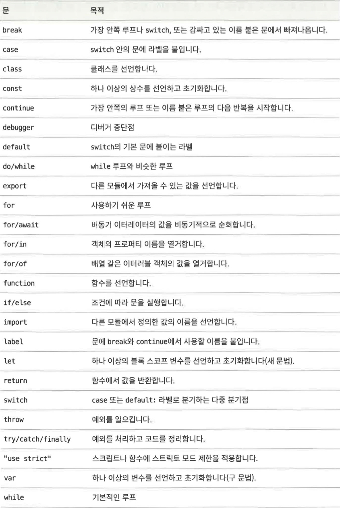
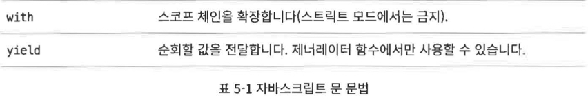

## 5.1 표현문

1. 할당이나 함수 호출처럼 부수 효과가 있는 표현식

    - 할당문은 표현문의 주요 카테고리 중 하나이다.

    ```jsx
    greeting = "Hello " + name;
    i *= 3;
    ```

    - 증가와 감소 연산자 `++`와 `--` 도 할당문과 관련이 있다.
        - 이들은 할당을 수행한 것처럼 변수의 값을 바꾸는 부수 효과가 있다.
        ```jsx
        counter++;
        ```
    - `delete` 연산자에는 객체 프로퍼티를 삭제하는 중요한 부수 효과가 있다.

    ```jsx
    delete o.x;
    ```

    - 함수 호출도 표현문의 주요 카테고리 중 하나이다.
        - 함수 호출은 표현식이지만 프로그램의 상태나 호스트 환경에 영향을 미치는 부수효과가 있다.

## 5.2 복합문과 빈 문

1. 문 블록

    - 문 블록은 문 여러 개를 묶어 복합문으로 만든다.
        - 그저 문 여러개를 중괄호로 묶은 것
    - 복합문은 문이 하나인 것 처럼 동작한다.

    ```jsx
    {
        x = Math.PI;
        cx = Math.cos(x);
    }
    ```

1. 자바스크립트 문법은 공식적으로 단일 하위 문을 허용한다.
    - 문 블록을 사용하면 허용되는 하위 문 하나에 문 여러개를 넣을 수 있다.

## 5.3 조건문

1. 지정된 표현식의 값에 따라 다른 문을 실행하기도, 실행하지 않기도 한다.
    - 분기문이라고도 함.

### 5.3.1 if

1. `if` 문은 자바스크립트가 조건에 따라 문을 실행할 수 있게 하는 기본적인 제어문이다.

1. `if` 문의 형태

    ```jsx
    if (expression) {
        statement1;
    } else {
        statement2;
    }
    ```

    - `expression`을 평가하고
        - 결괏값이 `true` 같은 값이면 `statement1` 문을 실행한다.
        - 결괏값이 `false` 같은 값이면 `statement2` 문을 실행한다.

1. 문 블록
    - 문이 하나 일때는 문 블록을 사용하지 않을 수 있지만 이해하고, 관리하고, 디버그하기 쉽게 하려면 문 블록을 작성해주자.
    - 예기치 못한 결과값이 나올수 있다.

### 5.3.2 else if

1. `if/else` 문은 표현식을 평가하고 그 결과에 따라 두 코드 중 하나를 실행한다.
    - 하지만 선택지가 여럿이라면?
    - `else if` 문을 사용하자.
2. 엄밀히 말해 `else if`는 자바스크립트 문이 아니다.
    - `if/else` 문을 반복해 사용해야 할 때 흔히 쓰는 관용적 표현이다.

### 5.3.3 switch

1. 모든 분기점이 같은 표현식의 값에 좌우된다면 `else if` 가 최선의 선택은 아니다.

1. `switch` 문의 형태

    ```jsx
    switch (expression) {
        case 1:
            // 코드 블록 #1을 실핸한다.
            break;
        case 2:
            // 코드 블록 #2을 실핸한다.
            break;
        case 3:
            // 코드 블록 #3을 실핸한다.
            break;
        default:
            // 코드 블록 #4을 실핸한다.
            break;
    }
    ```

    - `switch` 문이 실행되면 먼저 `expression`의 값을 계산한 후, `case`의 라벨의 표현식 중에서 `expression`과 같은 값으로 평가되는 것을 찾는다.
        - 이때 `===` 연산자를 기준으로 판단한다.
    - 일치하는 것을 찾으면 해당 `case`의 코드 블록을 실행한다.
    - `case`를 찾지 못하면 `default:` 라벨을 찾는다.
    - `default:` 라벨 조차 없으면 `switch`문은 코드 블록 전체를 건너 뛴다.

1. `break` 문
    - 인터프리터가 `switch` 문의 끝으로 빠져나가서 이어지는 문을 실행하게 하는 명령이다.
    - `switch` 문의 `case` 절은 코드의 출발점을 지정할 뿐, 어디서 끝나는지 지정하지 않는다.
        - `break` 문이 없다면 `switch`문은 `expression` 의 값과 일치하는 `case` 라벨을 찾아 코드를 실행한 다음, 블록의 끝에 다다를 때까지 실행을 계속한다.
    - `break`문 대신 `return`문을 써도 된다.
1. `switch` 문을 실행할 때마다 `case` 표현식 전체가 평가되는 것은 아니므로 `case` 표현식에는 함수 호출이나 할당처럼 부수 효과가 있는 것은 피해야한다.
    - 가장 안전한 방법은 `case` 표현식에 일정한 표현식만 쓰는 것!

## 5.4 반복문

1. 반복문은 경로를 자기 자신 쪽으로 구부려 코드 일부를 반복하는 문이며 루프라고 하기도 한다.

    - 루프는 모두 배열 요소를 순회할 때 쓸 수있다.

1. 자바스크립트의 반복문 종류
    - `while`
    - `do/while`
    - `for`
    - `for of ( 변형인 for/await )`
    - `for in`

### 5.4.1 while

1. `while`문은 자바스크립트의 기본 루프이다.

1. `while`문의 형태

    ```jsx
    while (expression) {
        statement;
    }
    ```

    - 인터프리터는 먼저 `expression`를 평가한다.
        - 값이 `false` 같은 값이면 인터프리터는 루프 바디를 건너 뛰고 다음 문으로 이동한다.
        - 값이 `true` 같은 값이면 인터프리터는 `statement`를 실행하고, 루프 맨 위로 올라가 `expression`를 평가하길 반복한다.
    - 쉽게 말하면, 인터프리터는 `expression`이 true 같은 값인 동안 `statement`를 반복저으로 실행한다.

### 5.4.2 do/while

1. `do/while` 루프는 `while` 루프와 비슷하지만 루프 표현식이 루프 맨 위가 아니라 맨 아래에서 평가된다는 점이 다르다.

    - 따라서, 루프 바디는 항상 최소 한 번은 실행 된다.

1. `do/while`문의 형태

    ```jsx
    do {
        statement;
    } while (expression);
    ```

1. `do/while`문과 `while`문의 차이점
    - `do/while` 루프는 루프 시작을 알리는 `do` 키워드와 루프의 끝을 알리고 조건을 평가하는 `while` 키워드가 모두 있어야 한다.
    - `do/while` 루프는 반드시 항상 세미콜론으로 끝나야 한다.

### 5.4.3 for

1. for문은 널리 쓰이는 루프 패턴을 단순화 한것이다.

    - 루프 패턴
        - 대부분의 루프에는 어떤 형태로든 카운터 변수가 있다.
            - 이 변수는 루프 시작 전에 초기화되고 루프가 반복될 때마다 테스트 된다.
        - 마지막으로 루프 바디 끝에서 카운터 변수를 다시 테스트하기 직전에 증가시키거나 다른 방식으로 업데이트를한다.
    - 이런 루프에서 초기화, 테스트, 업데이트는 필수불가결한 동작이다.
    - for 문은 이 세 가지 동작을 표현식 하나로 묶고, 이들을 루프 문법에 명시적으로 포함한다.

1. for문의 형태

    ```jsx
    for (initalize; test; increment) {
        statement;
    }
    ```

    - `initalize, test, increment`는 세미콜론으로 구분하며 각각 루프 변수의 초기화, 테스트, 증가를 담당한다.
        - 콤마 연산자를 사용하여 여러 개의 초기화와 증가 표현식을 표현식 하나로 묶어 `for` 루프에 사용할 수 있다.

1. `while`문과의 비교

    ```jsx
    initalize;
    while (test) {
        statement;
        increment;
    }
    ```

1. 생략 가능
    - `for` 루프의 세 가지 표현식은 전부 생략할 수 있지만 세미클론은 필수이다.
        - 단 test 표현식을 생략하면 루프는 무한히 반복한다.

### 5.4.4 for of

1. `for of`는 ES6에서 정의한 새 반복문이다.

    - `for` 키워드를 사용하긴 하지만 일반적인 `for` 루프와는 완전히 다르다.
    - `for in` 이랑도 다르다.

1. `for of` 루프는 이터러블 객체에서 동작한다.
    - 이터러블 객체
        - 배열, 문자열, 세트, 맵
        - 이들은 `for of` 루프로 순회할 수 있는 일종의 연속체 또는 일련의 요소이다.
1. `for of` 예제

    ```jsx
    let data = [1, 2, 3, 4, 5, 6, 7, 8, 9];
    let sum = 0;

    for (let element of data) {
        sum += element;
    }

    sum; // 45
    ```

    - `for` 키워드를 쓰고, 그 뒤에 이 루프가 하는 일을 괄호로 묶어서 표현했다.
        - 여기서 괄호 안에 는 변수 선언이 있고, `of` 키워드가 있고, 그 뒤에는 `data` 배열처럼 이터러블 객체로 평가되는 표현식이 있다.
    - 루프 바디는 `data` 배열의 각 요소에 대해 한 번씩 실행된다.
        - 루프 바디를 실행하기 전, 배열의 다음 요소가 `element` 변수에 할당된다.
    - 배열은 ‘동적으로’ 순회한다.
        - 즉 반복 중간에 배열 자체에 변화가 발생한다면 반복 결과가 바뀌기도 한다.

### for of와 객체

1. 객체는 기본적으로 이터러블이 아니다.

    - 일반적인 객체에 `for of`을 사용하려 하면 런타임에 `TypeError`가 일어난다.

1. 객체의 프로퍼티를 순회하고 싶다면 `for in`을 사용하거나 `Object.key()` 메서드에 for of를 사용하자.

1. 객체 프로퍼티의 키와 값이 모두 필요하다면 `Object.entries()`를 사용하자!

    - `Object.entries()`
        - 배열의 배열을 반환한다.
        - 그 내부 배열은 객체의 프로퍼티에 대응하는 키-값 쌍이다.

    ```jsx
    let o = {
        x: 1,
        y: 2,
        z: 3,
    };

    let paris = "";
    for (let [k, v] of Object.entries(o)) {
        paris += k + v;
    }
    paris; // x1y2z3
    ```

### for of와 문자열

1. ES6 이후에는 문자열을 문자 단위로 순회할 수 있다.
    - 문자열은 UTF-16 문자가 아니라 유니코드 코드 포인트로 순회한다.

### for of와 세트, 맵

1. ES6에 내장된 `Set`와 `Map`클래스는 이터러블이다.

1. `Set`

    - `Set`을 `for of`로 순회하면 루프 바디는 `Set`의 각 요소에 대해 한 번씩 실행된다.

    ```jsx
    let text = "Na na na na na na Betman!";
    let wordSet = new Set(text.split(" "));
    let unique = [];
    for (let word of wordSet) {
        unique.push(word);
    }
    unique; // ["Na", 'na', 'Betman!']
    ```

1. Map
    - `Map` 객체의 이터레이터는 키-값 쌍을 순회한다.
        - 반복할 때마다 이터레이터는 첫 번째 요소가 키, 두번째 요소가 키에 대응하는 값인 배열을 반환한다.
        ```jsx
        let m = new Map([[1, "one"]]);
        for (let [key, val] of m) {
            key; // 1
            val; // 'one'
        }
        ```

### for await를 사용한 비동기 순회

1. ES2018은 비동기 이터레이터라는 새로운 이터레이터를 도입하면서 `for await`를 도입했다.

### 5.4.5 for in

1. `for in` 루프는 `for of` 루프와 거의 비슷하다

    - `for of`는 `of` 다음에 이터러블 객체가 와야 하지만 `for in` 루프는 `in` 다음에 어떤 객체든 쓸 수 있다.

1. `for in`의 형태

    ```jsx
    for (variable in object) {
        statement;
    }
    ```

    - `variable`에는 일반적으로 변수 이름이 들어가지만 변수 선언이 될 수도 있고 할당 표현식에서 왼쪽에 올 수 있는 것은 무엇이든 가능하다.
    - `object`는 객체로 평가되는 표현식

1. 실행

    - 자바스크립트 인터프리터는 `for in` 문을 실행할 때 첫번째로 `object` 표현식을 평가한다.
        - 표현식이 `null`이나 `undefined`로 평가되면 인터프리터는 루프를 건너 뛰고 다음 문으로 이동한다.
        - 그렇지 않으면 인터프리터는 객체의 열거 가능한 프로퍼티 각각에 한 번씩 루프 바디를 실행한다.
    - 각 반복에 앞서 인터프리터는 `variable`를 표현식을 평가하고 그 변수에 프로퍼티 이름을 할당한다.

1. 주의점
    - `for in` 루프는 실제로 객체의 프로퍼티 전체를 열거하지 않는다.
        - 이름이 심벌인 프로퍼티는 열거하지 않는다.
        - 이름이 문자열인 프로퍼티 중에서도 열거 가능한 프로퍼티만 순회한다.
        - 자바스크립트에서 정의하는 내장 메서드는 열거 가능하지 않다.
    - 내가 직접 정의한 프로퍼티와 메서드는 기본적으로 열거 가능하다.
    - 열거 가능한 상속된 프로퍼티 역시 `for in` 루프의 순회 대상에 속한다.
        - 따라서, 모든 객체에서 상속하는 프로퍼티를 정의하고 `for in` 루프를 사용한다면 결과가 예상과 다를 수 있다.
            - 이 때문에 많은 프로그래머들은 `for in` 대신 `Object.keys()`와 `for of` 조합을 더 선호한다.
    - `for in` 루프의 바디에서 아직 열거되지 않은 프로퍼티를 삭제한다면 그 프로퍼티는 순회 대상에서 빠진다.
    - 루프 바디에서 객체의 새 프로퍼티를 정의한다면 그 프로퍼티는 순회 대상에 있을 수도 있고 없을 수 도 있다.
        - 자세한건 6장에서 설명

## 5.5 점프문

1. 자바스크립트 인터프리터가 소스 코드의 다른 위치로 이동하게 하는 문이다.

    - `break`
        - 인터프리터를 루프를 비롯한 다른 문의 끝으로 이동시킨다.
    - `continue`
        - 루프 바디의 나머지를 생략하고 루프 맨 위로 돌아가 새 반복을 시작하게 함.
    - `return`
        - 인터프리터가 함수에서 빠져나와 호출자에게 함수 호출 값을 전달하게 한다.
    - `yield`

        - [제너레이터 함수](https://developer.mozilla.org/ko/docs/Web/JavaScript/Reference/Global_Objects/Generator)에서 사용하는 `return` 문과 비슷한 문이다.

            - 제너레이터 함수는 여러 개의 값을 필요에 따라 하나씩 반환할 수 있다.
            - 제너레이터를 만들려면 특별한 문법 구조, `function*`이 필요하다.
                - `next()` : `[yield](https://developer.mozilla.org/ko/docs/Web/JavaScript/Reference/Operators/yield)` 표현식을 통해 yield된 값을 반환한다.

            ```jsx
            function* generator() {
                yield 1;
                yield 2;
                yield 3;
            }

            // 제너레이터 함수를 호출하면 코드가 실행되지 않고,
            // 대신 실행을 처리하는 특별 객체, '제너레이터 객체’가 반환
            const gen = generator(); // "Generator { }"

            console.log(gen.next().value); // 1
            console.log(gen.next().value); // 2
            console.log(gen.next().value); // 3
            ```

    - `throw`
        - 예외를 일으키는 문
            - 예외 처리를 담당하는 `try,catch,finally` 문과 함께 사용하도록 설계되었다.
            - 예외가 일어나면 인터프리터는 가장 가까운 예외 핸들러로 점프함.
                - 핸들러는 동일한 함수 안에 있을 수도 있고 콜 스택을 거슬러 올라가 호출자에게 있을 수도 있다.

    > 자바스크립트는 문에 라벨, 즉 이름을 붙일 수 있게 허용하는데 `break`와 `continue`는 이 라벨을 인식할 수 있다.

    ### 5.5.1 라벨 붙은 문

    - 어떤 문이든 그 앞에 식별자와 콜론을 붙여서 라벨을 만들 수 있다.

        ```jsx
        identifier: statement;
        ```

        - 문에 라벨을 붙이는 것은 프로그램 다른 곳에서 참조할 수 있는 이름을 짓는 것과 같다.
        - 루프에 이름을 붙이면 루프 바디 안에서 `break`와 `continue` 문을 사용해 루프를 빠져나가거나 루프 맨 위로 점프해 다음 반복으로 넘어갈 수 있다.
            ```jsx
            mainloop: while (token !== null) {
                // 코드 생략
                continue mainloop;
                // 코드 생략
            }
            ```

    - `identifier`
        - 유효한 자바스크립트 식별자 라면 예약어를 제외한 무엇이든 사용할 수 있다.
        - 라벨의 네임스페이스와 변수나 함수의 네임스페이스는 다르므로, 같은 식별자도 사용 가능하다.
        - 자신을 포함한 문과 같은 라벨을 붙일 수 없지만, 중첩되지 않은 두 문에는 같은 라벨을 붙일 수 있고 라벨 붙은 문을 모아서 다시 라벨을 붙일 수도 있다.
            - 즉, 모든 문은 여러 개의 라벨을 가질 수 있다.

    ### 5.5.2 break

    1. `break`문

        - 단독으로 사용하면 자신을 포함하고 있는 가장 가까운 루프 또는 `switch`문을 즉시 빠져나간다.

        ```jsx
        break;
        ```

        - 루프나 `switch`문을 빠져나가므로 빠져나갈 문 안에 있어야만 유효하다.

    1. `break` 키워드 다음에 문 라벨(콜론 없이 식별자만)을 붙일 수 있다.

        ```jsx
        break labelname;
        ```

        - `break` 문에 라벨을 사용하면 해당 라벨이 붙은 문을 종료한다.
        - `break`를 포함하는 문에 라벨이 없을 때 이렇게 라벨을 쓰면 문법 에러가 일어난다.
        - `break` 문은 자신을 둘러싼 문이면 어떤 형태든 ‘빠져나갈’ 수 있다.
            - 그저 이름을 붙이기 위해 중괄호를 썼을 뿐인 문 블록에서도 빠져나갈 수 있다.
        - `break`문에 라벨을 사용하는 경우는 탈출하려는 문이 가장 가까운 루프나 `switch`문이 아닐때이다.

            ```jsx
            let matrix = getData(); // 숫자로 구성된 2차원 배열을 만든다.
            // 행렬에 포함된 숫자를 모두 더한다.
            let sum = 0,
                success = false;

            computeSum: if (matrix) {
                for (let x = 0; x < matrix.length; x++) {
                    let row = matrix[x];
                    if (!row) break computeSum;
                    for (let y = 0; y < row.length; y++) {
                        let cell = row[y];
                        if (isNaN(cell)) break computeSum;
                        sum += cell;
                    }
                }
                success = true;
            }
            // break 문은 여기로 점프한다. 만약 sucess의 값이 false인 상태로 여기 도달했다면
            // 전달한 행렬에 뭔가 문제가 있는것이다.
            // 문제가 없다면 sum은 행렬에 포함된 모든 셀의 합이다.
            ```

    ### 5.5.3 continue

    1. `continue`문

        - 루프 안에서 `continue`를 사용하면 루프의 다음 반복으로 넘어간다.

        ```jsx
        continue;
        ```

        - 라벨과 함께 사용 가능하다.

        ```jsx
        continue labelname;
        ```

        - `continue`문은 라벨이 있든 없든 루프 바디 안에서만 사용할 수 있다.
            - 다른 곳에서 사용하면 문법에러가 일어난다.

    1. `continue`를 만난 인터프리터

        - 인터프리터는 continue 문을 만다면 루프의 현재 반복을 멈추고 다음 반복으로 넘어간다.
            - 따라서 루프 타입에 따라 결과가 다를 수 있다.

        ### 루프 타입에 따른 continue

        - while 루프
            - `expression`(표현식)을 루프 맨 위에서 다시 평가하고, `true`이면 루프 바디를 맨 위에서부터 실행한다.
        - do while 루프
            - 루프 맨 아래까지 건너뛴 다음, 루프 조건을 다시 평가한 후 맨 위부터 재 시작한다.
        - for 루프
            - `increment` (증가) 표현식을 평가하고, 다시 `test` (테스트) 표현식을 평가해서 반복을 재개할지 결정한다.
        - for in, for of 루프
            - 다음 값 또는 프로퍼티 이름이 `variable`(변수)에 할당된다.

    1. `continue` 문에 라벨을 붙여서, 중첩된 루프에서 가장 가까운 루프가 아닌 다른 루프를 재시작할 수 있다.

    ### 5.5.4 return

    1. 함수 호출은 표현식이고, 표현식은 모두 값이 있다.

        - `return`문은 그 함수 호출의 값을 지정한다.

        ```jsx
        return expression;
        ```

    1. `return`
        - `return`문은 함수 바디 안에서만 쓸수 있다.
            - 다른 곳에 사용하면 문법 에러가 일어난다.
        - `return`문이 실행되면 `return` 문을 포함한 함수는 `expression`의 값을 호출자에게 반환한다.
            ```jsx
            function square(x) {
                return x * x;
            }
            square(2); // 4
            ```
        - `return`문이 없는 함수 호출은 함수 바디의 각 문을 차례대로 실행한 다음 호출자에게 돌아간다.
            - 이런 경우 호출 표현식은 `undefined`로 평가된다.
        - 함수는 `return`문을 실행하는 즉시 호출자에게 돌아가며 함수 바디 안에 있는 다른 문은 무시한다.
        - `return`문을 `expression` 없이 사용해도 호출자에게 `undefined`를 반환한다.

    ### 5.5.5 yield

    1. `yield`
        - 제너레이터 함수안에서만 사용되며 실제로 제어권을 넘기지 않고 다음 값만 넘길때 사용된다.
            ```jsx
            // 일정 범위의 정수를 전달하는 제너레이터 함수
            function* range(from, to) {
                for (let i = from; i < to; i++) {
                    yield i;
                }
            }
            ```

    ### 5.5.6 throw

    1. 예외(`exception`)는 예외적인 조건이나 에러가 일어났다는 신호이다.

        - 예외를 일으키는(`throw`) 것은 그런 에러나 예외적 조건이 일어났다는 신호를 보내는 것이다.
            - 자바스크립트에서 예외는 런타임 에러가 일어났을 때, 그리고 프로그램에서 직접 `throw`문을 통해 일으켰을 때 발생한다.
                ```jsx
                throw expression;
                ```
        - 예외를 캐치하는 (`catch`)것은 처리, 즉 그 예외를 복구하기 위해 필요하거나 적절한 동작을 수행하는 것이다.
            - 예외는 `try/catch/finally`문에서 캐치한다.

    1. `expression`은 어떤 타입의 값으로든 평가될 수 있다.

        - 에러 코드로 숫자를 보낼수도 있고 사람이 읽기 쉬운 에러 메세지를 보낼 수도 있다.
        - 자바스크립트 인터프리터는 에러를 일으킬 때 `Error` 클래스와 그 서브클래스를 사용하며, 프로그램에서도 이들을 이용할 수 있다.
            - `Error` 객체에는 에러 타입을 나타내는 `name` 프로퍼티, 생성자 함수에 전달될 문자열을 담은 `message` 프로퍼티가 있다
        - 예제
            ```jsx
            function factorial(x) {
                //인자가 유효하지 않으면 예외를 일으킴
                if (x < 0) throw new Error("x must not be negative");
                // 그러지 않다면 다음로직..
            }
            ```

    1. 예외가 일어나면?
        - 자바스크립트 인터프리터는 즉시 프로그램 실행을 멈추고 가장 가까운 예외 핸들러로 점프한다.
            - 에러헨들러는 `catch`문을 사용한다.
        - 에외를 일으킨 코드 블록에 연결된 `catch` 절이 없다면 인터프리터는 다음으로 가장 가까운 코드 블록에 예외 핸들러가 있는지 검색한다.
            - 이 과정을 핸들러를 찾을 때까지 반복한다.
            - `try/catch/finally`문이 없는 함수에서 예외가 일어나면 예외는 해당 함수를 호출한 코드까지 올라간다.
                - 이런식으로 예외는 자바스크립트 메서드와 콜 스택을 계속 거슬러 올라간다.
                - 끝까지 예외 핸들러를 찾지 못한다면 예외를 에러로 간주하고 사용자에게 보고한다.

    ### 5.5.7 try/catch/finally

    1. `try/catch/finally`문은 자바스크립트의 예외 처리 매커니즘이다.

        - `try`절은 처리하려 하는 예외가 담긴 코드 블록이다.
            - `try` 블록 다음에는 `catch` 절이 있으며, `try` 블록에서 예외가 일어나면 `catch` 절이 호출된다.
        - `catch`절 다음에는 `finally` 블록이 있다.
            - 이 절은 `try` 블록에서 무슨 일이 있어났든 관계없이 실행되는 일종의 정리 코드이다.
        - `catch`와 `finally` 블록 모두 선택사항이다.
            - 하지만 `try`블록 뒤에 둘 중 하나는 반드시 써야한다.
        - `try,catch,finally` 블록은 모두 중괄호에 둘러싸여 있다.
            - 이 중괄호는 문법의 일부분이며 절대 생략 불가능.

    1. `try/catch/finally`문의 문법과 목적

        ```jsx
        try {
            // 문제가 없을 경우 일반적으로 이 코드는 블록 위쪽에서 아래쪽으로 실행된다.
            // 이 코드는 때때로 예외를 일으킬 수 있는데,
            // throw문을 통해 예외를 직접 일으키거나 예외를 일으키는 메서드를 호출하여 간접적으로 일으킨다.
        } catch (e) {
            // 이 블록의 문은 try 블록에서 예외를 일으켰을 때만 실행된다.
            // 이 문은 로컬 변수 e를 사용할 수 있으며 이 변수는 Error 객체 또는 전달받은 값을 참조한다.
            // 이 블록은 예외를 처리할 수도 있고, 아무 일도 하지 않고 무시할 수 있으며
            // throw를 통해 다시 예외를 일으킬수 있다.
        } finally {
            // 이 블록은 try 블록에서 무슨 일이 있었든 항상 실행된다.
            // 경우의 수
            // 1) 정상적으로 try 블록의 끝에 도달한 경우,
            // 2) break, continue, return 문을 통해 try문을 빠져나가는 경우
            // 3) 위 catch 절에서 처리한 예외 때문에 try 블록이 종료된 경우
            // 4) 예외가 캐리되지 않고 계속 전파되는 경우
        }
        ```

    1. catch

        - `catch` 키워드 뒤에는 일반적으로 괄호 안에 식별자를 쓴다.
        - 예외를 캐치하면 그 예외와 연결된 값(예를 들어 `Error` 객체)이 이 매개변수에 할당된다.
        - `catch`절이 받은 식별자는 블록 스코프이므로 `catch` 블록 안에서만 존재한다.

    1. finally
        - `finally`절은 `try`블록의 코드가 어떻게 끝났든 관계없이, 일부분이라도 실행되면 항상 실행된다.
            - 일반적으로 `try`절의 코드 이후를 정리하는 목적으로 사용된다.
        - `try`블록에서 예외가 일어났고 그에 연결된 `catch` 블록이 있다면 인터프리터는 먼저 `catch` 블록을 실행한 다음 `finally` 블록을 실행한다.
            - 예외를 처리할 `catch` 블록이 없다면 인터프리터는 먼저 `finally` 블록을 실행하고, 가장 가까운 `catch` 절로 점프한다.
        - `finally` 블록 자체에 `return, continue, break, throw` 문이 있거나 예외를 일으키는 함수를 호출한다면 인터프리터는 대기시켜 둔 점프를 취소하고 `finally` 블록을 따라 점프한다.
            - 즉, `finally` 절에서 예외를 일으키면 그 예외는 처리 중이던 예외를 모두 무시하고 우선권을 갖는다.
            - `finally` 절에 `return` 문이 포함되어 있으면 처리 중이던 예외가 완전히 처리되지 않았더라도 함수 실행을 종료한다.

## 5.6 기타문

### 5.6.1 with

1. `with` 문은 지정된 객체의 프로퍼티가 해당 블록의 스코프 안에 있는 변수인 것처럼 코드 블록을 실행한다.

    ```jsx
    with (object) statement;
    ```

    - `object`(객체)의 프로퍼티를 사용해 임시 스코프를 만들고, 그 스코프 안에서 `statement`(문)을 실행한다.

1. `with`의 문제점

    - `with`를 사용하는 자바스크립트 코드는 최적화가 어려우며 `with`문을 사용하지 않는 동등한 코드에 비해 상당히 느리게 동작한다.
    - 스트릭트 모드에서 `with`문을 금지한다.

1. 그렇다면?

    - 그냥 변수로 선언해서 사용하자

    ```jsx
    with (document.forms[0]) {
        // 폼요소에 접근
        name.value = "";
        address.value = "";
        email.value = "";
    }

    // --------------------------------

    let f = document.forms[0];

    f.name.value = "";
    f.address.value = "";
    f.email.value = "";
    ```

### 5.6.2 debugger

1. `debugger`문은 일반적으로 아무 일도 하지 않는다.

    - 하지만 디버거 프로그램이 존재하고 실행 중이라면 실행 환경에 따라서는 일종의 디버깅 동작을 수행할 수 있다.
    - 현실적으로 이 문은 일종의 중단점 기능을 해서 자바스크립트 코드 실행을 멈춘다.
        - 그러면 디버거에서 변수 값을 출력하거나 콜 스택을 살펴볼 수 있다.

1. 예제

    - `f()` 함수에 정의되지 않은 인자를 넘겨서 예외가 일어났는데, 어디에서 호출했는지 알수 없다는 가정.

    ```jsx
    function f(o) {
        if (o === undefined) debugger; // 디버깅 목적인 행
        // 함수 바디 나머지
    }
    ```

    - 인자 없이 `f()`를 호출하면 실행이 중단되므로 디버거를 써서 콜스택을 살펴보고 어디서 부정확하게 호출했는지 알아볼 수 있다.

### 5.6.3 “use strict”

1. `“use strict”`는 ES5에서 도입한 지시자(directive)이다.

    - 지시자는 문이 아니지만 `“use strict”`는 문과 가깝다.

1. `“use strict”` 지시자와 일반적인 문 사이에서의 차이점

    - 이 지시자에는 아무런 키워드도 없다.
        - 지시자는 특별한 문자열 리터럴로 구성된 표현문이다.
    - 이 지시자는 스크립트나 함수 바디의 맨 처음에만 존재할 수 있고 이 앞에 실제 문이 있어서는 안된다.

1. `“use strict”` 지시자는 이후의 코드가 스트릭트 코드, 즉 스트릭트 모드를 따르는 코드라는 선언이다.

    - 명시적으로 지시자를 사용하지 않더라도, `class` 바디나 ES6 모듈안에 있는 코드는 자동으로 스트릭트 코드가 된다.

1. 스트릭트 코드는 스트릭트 모드에서 실행된다.

    - 스트릭트 모드는 자바스크립트의 중요한 결함을 수정하고 더 강력히 에러를 체크하며 보완을 강화한 것이다.

1. 스트릭트 모드와 일반 모드의 차이점
    1. 스트릭트 모드에서는 `with` 문을 허용하지 않는다.
    2. 스트릭트 모드에서는 반드시 모든 변수를 선언해야 한다.
        - 선언된 변수, 함수, 함수 매개변수, `catch` 절 매개변수, 전역 객체의 프로퍼티가 아닌 식별자에 값을 할당하려 하면 `ReferenceError`가 일어난다.
        - 일반 모드에서는 전역 객체에 새 프로퍼티를 추가하는 방식으로 묵시적으로 전역 변수를 선언한다.
    3. 스트릭트 모드에서는 메서드가 아니라 함수로 호출된 함수의 `this` 값은 `undefined`이다.
        - 일반 모드에서는 함수로서 호출된 함수의 `this`는 항상 전역 객체이다.
        - 또한, 스트릭트 모드에서 함수를 `call()`이나 `apply()`로 호출하면 해당 함수의 `this` 값은 `call()`이나 `apply()`의 전달된 첫 번째 인자이다.
        - 일반 모드에서는 `null`이나 `undefined` 값이 전역 객체로 대체 되며 객체가 아닌 값은 객체로 반환된다.
    4. 스트릭트 모드에서는 읽기 전용인 프로퍼티에 할당하려 하거나 확장 불가능한 객체에 새 프로퍼티를 생성하려 하면 `TypeError`가 일어난다.
        - 일반 모드에서는 예외를 일으키지 않고 실패한다.
    5. 스트릭트 모드에서는 `eval()`에 전달된 코드는 호출자의 스코프에 변수를 선언 하거나 함수를 정의할 수 없다.
        - 대신 `eval()`을 위해 새로 생성된 스코프에 변수나 함수가 생성된다. 이 스코프는 `eval()`이 종료될 때 함께 종료된다.
    6. 스트릭트 모드에서는 함수의 `Arguments` 객체는 함수에 전달된 값을 정적으로 복사해 유지한다.
        - 일반 모드에서 `Arguments` 객체는 배열 요소와 이름 붙은 함수 매개변수가 같은 값을 참조하는 ‘마술 같은’ 동작 방식을 가진다.
    7. 스트릭트 모드에서는 `delete` 연산자 뒤에 변수, 함수, 함수 매개변수등 유효하지 않은 식별자를 사용할때 `SyntaxError`가 일어난다.
        - 일반 모드에서 `delete` 표현식을 이런식으로 사용하면 아무 일도 일어나지 않고 `false`로 평가 된다.
    8. 스트릭트 모드에서는 변경 불가인 프로퍼티를 삭제하려 하면 `TypeError`가 일어난다.
    9. 스트릭트 모드에서는 객체 리터럴을 써서 두 개 이상의 프로퍼티를 같은 이름으로 정의하려 하면 `SyntaxError`가 일어난다.
    10. 스트릭트 모드에서는 8진수 정수 리터럴이 허용되지 않는다.
        - 일반 모드에서는 일부 실행 환경에서 8진수 리터럴을 허용한다.
    11. 스트릭트 모드에서는 `eval`과 `arguments` 식별자가 키워드로 취급되며 그 값을 바꿀 수 없다.
        - 이 식별자에 값을 할당할 수 없고, 변수로 선언할 수 없고, 함수 이름이나 함수 매개변수 이름으로 사용할수 없으며, `catch` 블록의 식별자로 사용할 수 없다.
    12. 스트릭트 모드에서는 콜 스택을 살표보는 기능이 제한된다.
        - `argument.caller`와 `arguments.callee`는 모두 스트릭트 모두 함수에서 `TypeError`를 일으킨다.

## 5.7 선언

1. 자바스크립트의 선언은 상수, 변수, 함수, 클래스를 정의하고 모듈에서 값을 가져오고 내보낼 때 사용한다.

### 5.7.1 const, let, var

1. ES6 이후 `const`는 상수를, `let`을 변수를 선언한다.
    - ES6 전에는 `var` 키워드가 변수를 선언하는 유일한 방법이었고, 상수를 선언할 방법은 없었다.

### 5.7.2 함수

1. 함수 선언은 함수 객체를 생성하고 이를 지정된 이름에 할당한다.

    - 프로그램의 다른 곳에서 이 이름을 사용해 함수를 참조하고 그 코드를 실행할 수 있다.

1. 함수 선언은 어떤 블록에 있든 해당 블록의 코드보다 먼저 처리 되며, 함수 이름은 그 블록을 통틀어 함수 객체에 묶인다.

    - 함수를 선언하는 것을 호이스팅 된다. 라고 표현하는데, 함수 선언은 어떤 스코프에서 정의됐든 항상 그 맨 위에 있는 것처럼 처리하기 때문이다.
    - 결과적으로 함수를 선언하는 코드보다 앞에 있는 코드에서 그 함수를 호출 할 수 있다.

1. 특별한 종류의 함수
    - 제너레이터 함수
        - 제너레이터 선언은 `function` 키워드를 사용하는 것은 마찬가지이며, 그 뒤에 별표(\*)를 붙인다.
    - 비동기 함수
        - `function` 키워드 앞에 `async` 키워드가 붙는다.

### 5.7.3 클래스

1. ES6 이후에는 `class` 선언으로 새 클래스를 생성하고 이름을 붙인다.

    ```jsx
    class Circle {
        constructor(radius) {
            this.r = radius;
        }
        area() {
            return Math.PI * this.r * this.r;
        }
        circumference() {
            return 2 * Math.PI * this.r;
        }
    }
    ```

1. 함수와 달리 클래스 선언은 끌어올려지지 않으며, 위와 같이 선언한 클래스는 선언 하기 전에는 사용할 수 없다.

### 5.7.4 가져오기와 내보내기

1. import와 export 선언은 다른 모듈에서 정의한 값을 사용할 수 있게 한다.

1. 모듈

    - 모듈이란?
        - 자바스크립트 코드로 구성된 파일
        - 독자적인 전역 네임스페이스를 갖는다.
        - 다른 모듈에 완전히 독립적이다.
    - 한 모듈에서 정의한 값을 다른 모듈에서 사용하는 방법은 정의한 모듈에서 export로 값을 내보내고, 사용할 모듈에서 import로 가져오는 방법 밖에 없다.

1. import

    - import 지시자는 다른 모듈에서 하나 이상의 값을 가져오고, 현재 모듈에서 사용할 이름을 부여한다.
    - import 지시자의 몇가지 형태
        ```jsx
        import Circle from "....";
        import { PI, TAU } from "....";
        import { magnitude as hypotenuse } from "....";
        ```

1. export

    - 자바스크립트 모듈에 들어 있는 값은 비공개이며 명시적으로 내보내지 않는 한 다른 모듈에서 가져올 수 없다.
        - `exprot` 지시자를 사용해서 내보낼수 있다.
    - 현재 모듈에서 정의한 하나 이상의 값을 내보내며, 따라서 다른 모듈에서 가져올 수 있다는것을 의미한다.

    ```jsx
    const PI = Math.PI;
    const TAU = 2 * PI;
    export { PI, TAU };
    ```

    - `export` 키워드는 때때로 다른 선언을 변경하여 상수, 변수, 함수, 클래스를 정의하는 동시에 내보내는 일종의 복합 선언을 만들 수 있다.
        - 모듈에서 내보내는 값이 단 하나뿐일 때는 일반적으로 `export default`를 사용한다.
        ```jsx
        export const TAU = 2 * Math.PI;
        export function magnitude(x, y) {
            return Math.sqrt(x * y + y * y);
        }
        export default class Circle { .... }
        ```

## 5.8 자바스크립트 문 요약




