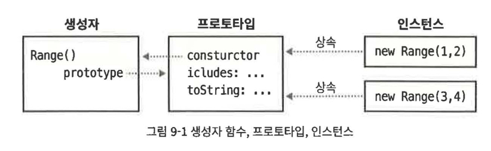

1. 자바스크립트 객체에 대해 설명하면서 객체는 프로퍼티의 고유한 집합이며 다른 어떤 객체와도 같지 않다고 했다.

    - 하지만 일부 프로퍼티를 공유하는 객체 클래스를 만드는 것이 유용할 때도 많다.
    - 클래스의 인스턴스는 자신의 상태를 정의하는 자체 프로퍼티도 갖지만, 자신의 동작을 정의하는 메서드도 가진다.
        - 이런 메서드는 클래스에서 정의하며 모든 인스턴스에서 공유한다.

1. 자바스크립트 클래스는 프로토타입 기반 상속을 사용한다.
    - 두 객체가 같은 프로토타입에서 프로퍼티를 상속한다면 이들은 같은 클래스의 인스턴스라고 부른다.
    - 두 객체가 같은 프로토타입을 상속한다면 일반적으로 이들은 같은 생성자 함수나 팩토리 함수를 통해 생성되고 초기화 됐을 가능성이 높다.

## 9.1 클래스와 프로토타입

1. 자바스크립트에서 클래스는 같은 프로토타입 객체에서 프로퍼티를 상속하는 객체집합이다.

    - 따라서 프로토타입 객체가 클래스의 핵심 기능이다.
    - 프로토타입 객체를 정의하고 `Object.create()`로 프로토타입을 상속하는 객체를 생성한다면 자바스크립트 클래스를 정의한 것이다.
    - 보통 클래스 인스턴스는 초기화가 더 필요하므로 새 객체를 생성하고 초기화하는 함수를 정의하는 것이 일반적이다.

1. 다음은 일정 범위의 값을 나타내는 클래스의 프로토타입 객체를 정의하고, 클래스의 인스턴스를 생성하고 초기화하는 팩토리 함수이다.

    ```jsx
    // Range 객체를 반환하는 팩토리 함수이다.
    function range(from, to) {
        // Object.create()를 써서 아래에서 정의하는 프로토타입 객체를 상속하는
        // 객체를 생성한다. 프로토타입 객체는 이 함수의 프로퍼티로 저장되며
        // Range 객체에서 공유하는 메서드를 정의한다.
        let r = Object.create(range.methods);

        // Range 객체의 시작점과 끝점(상태)을 저장한다.
        // 이들은 이 객체에 고유한 프로퍼티이며 상속되지 않는다.
        r.from = from;
        r.to = to;
        // 마지막으로 새 객체를 반환한다.
        return r;
    }

    // 이 프로토타입 객체는 Range 객체가 상속하는 메서드를 정의한다.
    range.methods = {
        // x가 범위 안에 있으면 true, 아니면 false를 반환
        // 이 메서드는 숫자뿐만 아니라 텍스트, 날짜 범위에도 동작한다.
        includes(x) {
            return this.from <= x && x <= this.to;
        },

        // 클래스 인스턴스를 이터러블로 만드는 제너레이터 함수이다.
        // 이 기능은 숫자 범위에서만 동작한다.
        *[Symbol.iterator]() {
            for (let x = Math.ceil(this.from); x <= this.to; x++) yield x;
        },

        // 범위를 나타내는 문자열을 반환한다.
        toString() {
            return "(" + this.from + "..." + this.to + ")";
        },
    };

    // Range 객체의 사용 예제
    let r = range(1, 3); // Range 객체를 생성
    r.includes(2); // true 2는 범위안에 있다.
    r.toString(); // "(1...3)"
    [...r]; // [1,2,3] 이터레이터를 통해 배열로 변환한다.
    ```

    - 이 코드는 `Range` 객체를 생성하는 팩토리 함수 `range()`를 정의한다.
    - `range()` 함수는 `methods` 프로퍼티에 클래스를 정의하는 프로토타입 객체를 저장한다.
    - `range()` 함수는 `Range` 객체에 `from`과 `to` 프로퍼티를 정의한다.
        - 이들은 공유되지 않고 상속되지 않는 프로퍼티이며 각 `Range` 객체의 고유한 상태를 나타낸다.
    - 프로토타입의 메서드 중에 계산된 이름 `Symbol.iterator`를 사용하는 메서드가 있다
        - 이 메서드가 `Range` 객체의 이터레이터를 정의한다.
        - 메서드 이름 앞에 있는 `*`는 일반적인 함수가 아니라 제너레이터 함수라는 의미이다.
    - `range.methods`에 정의된 공유, 상속되는 메서드는 모두 `range()` 팩토리 함수에서 초기화한 `from`과 `to` 프로퍼티를 사용한다.
        - 메서드는 `this` 키워드를 써서 자신이 호출된 객체를 참조하는 방식으로 해당 프로퍼티에 접근한다.
        - `this`를 이렇게 사용하는 것은 모든 클래스 메서드의 기본적인 특징이다.

## 9.2 클래스와 생성자

1. 생성자는 새로 생성된 객체를 초기화하도록 설계된 함수이다.

    - 생성자는 `new` 키워드를 사용해 호출한다.
    - `new`를 사용해 생성자를 호출하면 자동으로 새 객체가 생성되므로, 생성자 자체에서 할 일은 새 객체의 상태를 초기화하는 것뿐이다.
    - 생성자 호출에서 중요한 특징은 생성자의 `prototype` 프로퍼티가 새 객체의 프로토타입으로 사용된다는 것이다.

1. 프로토타입을 소개하면서 거의 모든 객체에 프로토타입이 있지만 `prototype` 프로퍼티를 가진 객체는 그중 일부라고 강조했다.

    - 정확히 말하면 `prototype` 프로퍼티를 가지는 것은 함수 객체이다.
    - 생성자 함수를 공유하는 개체는 모든 같은 객체를 상속하며, 따라서 같은 클래스 맴버이다.

1. 위의 `Range` 클래스를 팩토리 함수 대신 생성자 함수를 사용하여 만든 예제

    - ES6의 `class` 키워드를 지원하지 않는 자바스크립트 버전의 클래스…

    ```jsx
    // Range 객체를 초기화하는 생성자 함수이다.
    // 이 함수는 객체를 생성하거나 반환하지 않는다. 그저 초기화할 뿐이다.
    function Range(from, to) {
        // Range 객체의 시작점과 끝점(상태)을 저장한다.
        // 이들은 이 객체에 고유한 프로퍼티이며 상속되지 않는다.
        this.from = from;
        this.to = to;
    }

    // Range 객체는 모두 이 객체를 상속한다.
    // 코드가 동작하기 위해서는 프로퍼티 이름이 반드시 prototype이어야 한다.
    Range.prototype = {
        includes(x) {
            return this.from <= x && x <= this.to;
        },
        *[Symbol.iterator]() {
            for (let x = Math.ceil(this.from); x <= this.to; x++) yield x;
        },
        toString() {
            return "(" + this.from + "..." + this.to + ")";
        },
    };

    // Range 클래스의 사용 예제
    let r = new Range(1, 3);
    r.includes(2);
    r.toString();
    [...r];
    ```

    - 팩토리 함수와의 차이!!
        - 생성자 함수로 바뀌면서 `Range()`로 이름 변경
            - 생성자 함수는 어떤 의미로는 클래스를 정의한다고 할 수 있고, 클래스 이름은 관습적으로 대문자로 시작한다.
        - `new`
            - `Range()` 생성자를 new 키워드와 함께 호출했다.
                - 새 객체를 생성하기 위해 `Object.create()`를 호출하거나 다른 동작을 취할 필요는 없다.
        - 새 객체는 생성자를 호출하기 전에 자동으로 생성되며, `this` 값을 통해 접근할 수 있다.
            - `Range()` 생성자는 `this`를 초기화하기만 하면 된다.
        - 생성자는 새로 생성된 객체를 반환할 필요도 없다.
            - 생성자를 호출하면 자동으로 새 객체가 생성되고, 생성자를 그 객체의 메서드로 호출하며, 새 객체를 반환한다.
        - 프로토타입 객체의 이름
            - 팩토리 함수예제에서는 프로토타입에 `range.methods`라는 이름을 썼다.
                - 편리하고 알기 쉽지만 어떠한 강제성도 없다.
            - 생성자 함수예제에서는 프로토타입에 `Range.prototype`이라는 이름을 썼다.
                - 이 이름은 **규칙**이다.
                - `Range()` 생성자를 호출하면 자동으로 `Range.prototype`을 새 `Range` 객체의 프로토타입으로 사용한다.
        - 두 예제 모두 생성자나 메서드를 정의할 때 화살표 함수를 사용하지 않았다.
            - 화살표 함수는 prototype 프로퍼티가 없으므로 생성자로 사용할 수 없다.
            - 화살표 함수는 호출한 객체가 아니라 자신이 정의된 컨텍스트에서 this 키워드를 상속한다.
            - 메서드는 자신을 호출한 인스턴스를 `this`로 참조할 수 있다는 것이 특징이므로 메서드에 화살표 함수를 사용하는 것은 무의미하다.

### 9.2.1 생성자, 클래스 본질, instanceof

1. 프로토타입 객체는 클래스의 본질이다.

    - 두 객체가 같은 프로토타입 객체를 상속하지 않는다면 같은 클래스의 인스턴스가 아니다.
    - 생성자 함수는 그렇지 않다.
        - 서로 다른 생성자 함수의 `prototype` 프로퍼티가 같은 프로토타입 객체를 참조 할 수도 있다.
        - 그리고 두 생성자가 같은 클래스의 인스턴스를 초기화할 수 있다.

1. 생성자는 프로토타입만큼 본질적이지는 않지만 클래스에서 공개적인(`public`) 부분을 담당한다.

    - 가장 명백하게 드러나는 점은 생성자 함수의 이름이 대부분 클래스 이름을 따른다는 것이다.
        - 예를 들어 `Range` 객체를 생성할 때 `Range()` 생성자를 사용한다.
    - 또한 객체가 클래스의 맴버인지 확인할 때 생성자는 `instanceof` 연산자의 오른쪽 피연산자가 된다.
        ```jsx
        r instanceof Range; // true r은 Range.prototype을 상속한다.
        ```

1. `instanceof`
    - 이 연산자의 왼쪽 피연산자는 테스트할 객체이며 오른쪽 피연산자는 생성자 함수이다.
    - 상속 여부를 확인한다.
        - 직접 상속하지 않아도 상관 없다.
        - 생성자 함수를 상속하는 객체를 상속하는 객체의 상속하는 객체를 상속한다고 하더라도 표현식은 `true`로 평가된다.
    - 엄밀히 말해 `instanceof` 연산자는 실제로 생성자 함수를 통해 초기화 됐는지는 체크하지 않는다.
        - 단지 `prototype`을 상속하는지만 체크한다.
        - 예를 들어 함수 `Strange()`를 정의하고 이 함수의 프로토타입을 `Range.prototype`으로 정했다면 `instanceof`는 `new Strange()`로 생성된 객체를 `Range` 객체로 판단한다.
            ```jsx
            function Strange() {}
            Strange.prototype = Range.prototype;
            new Strange() instanceof Range; // true
            ```

### 9.2.2 생성자 프로퍼티

1. 화살표 함수, 제너레이터 함수, 비동기 함수를 포함해 일반적인 자바스크립트 함수는 모두 생성자로 사용될 수 있고, 생성자를 호출할 때는 `prototype` 프로퍼티가 필요하다.

    - 따라서 일반적인 자바스크립트 함수는 모두 자동으로 `prototype` 프로퍼티를 갖습니다.
    - 이 프로퍼티의 값은 열거 불가인 `constructor` 프로퍼티 단 하나이다.
        - `constructor` 프로퍼티의 값은 함수 객체이다.

    ```jsx
    let F = function () {}; // 함수 객체이다.
    let p = F.prototype; // F에 연결된 프로토타입 객체이다.
    let c = p.constructor; // 프로토타입에 연결된 함수이다.
    c === F; // true :모든 F에 대해 F.prototype.constructor === F
    ```

1. `constructor` 프로퍼티를 가진 미리 정의된 프로토타입 객체가 존재한다는 것은, 그 객체가 일반적으로 자신의 생성자를 참조하는 `constructor` 프로퍼티를 상속한다는 의미이다.

    - 생성자는 클래스의 공개된 부분을 담당하므로 이 생성자 프로퍼티가 객체에 클래스를 부여한다.

    ```jsx
    let o = new F();
    o.construct === F; // true
    ```

1. 생성자 함수, 프로토타입 객체, 프로토타입에서 생성자를 향하는 역참조, 생성자에서 생성된 인스턴스 사이의 관계를 나타내는 그림

    
